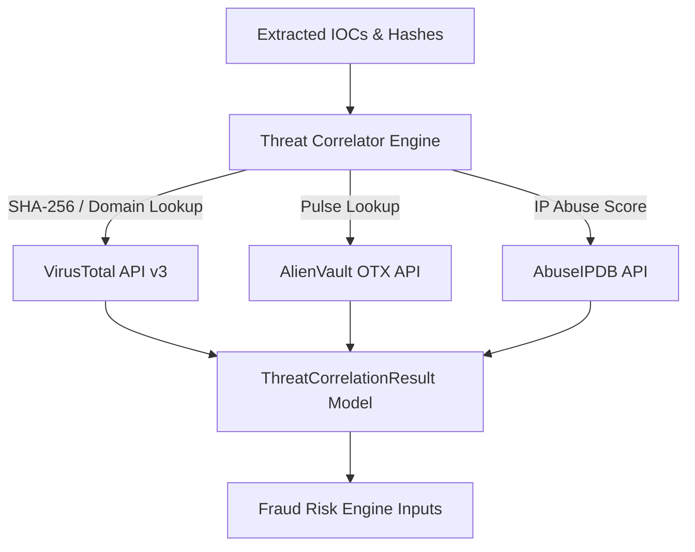

# 07 — Fraud Intelligence Engine Specification

```yaml
Module Title:        Threat Intelligence Correlation & Family Classification
Version:             2.3.0-STABLE
Primary Files:       shared/sudarshan_core/services/threat_correlator.py
                     shared/sudarshan_core/engines/classification_engine.py
Test Suite:          backend/tests/test_risk_engine.py
```

---

## Table of Contents
- [1. Executive Overview](#1-executive-overview)
- [2. Threat Intelligence Correlation Architecture](#2-threat-intelligence-correlation-architecture)
- [3. External Threat Intel Providers](#3-external-threat-intel-providers)
- [4. Deterministic Malware Family Classification](#4-deterministic-malware-family-classification)

---

## 1. Executive Overview

The **Fraud Intelligence Engine** correlates extracted indicators of compromise (SHA-256 hashes, domains, IP addresses, URL endpoints) against external threat intelligence sources and classifies suspicious APK binaries into known banking malware families.

---

## 2. Threat Intelligence Correlation Architecture (`threat_correlator.py`)



---

## 3. External Threat Intel Providers

1. **VirusTotal API**: Queries file SHA-256 hashes and domain IOCs to compute detection ratios (`sha256_detections` / `sha256_total`) and vendor malicious labels.
2. **AlienVault OTX**: Queries pulses and threat campaigns associated with extracted C2 IPs.
3. **AbuseIPDB**: Queries IP abuse confidence scores ($0 - 100$) and country location metadata.

If external APIs fail or are unconfigured, `threat_correlator.py` degrades gracefully and returns a clean `available: false` correlation payload.

---

## 4. Deterministic Malware Family Classification (`classification_engine.py`)

Classes binaries into target banking trojan families based on rule signatures:

```python
FAMILY_RULES = {
    "Drinik": ["has_accessibility_abuse", "has_sms_read_write", "targets_indian_banks"],
    "Xenomorph": ["has_accessibility_abuse", "has_system_alert_window", "has_reflection"],
    "Cerberus": ["has_sms_read_write", "has_system_alert_window"],
}
```

Returns `family_classification` (e.g., `Drinik`, `Xenomorph`, or `Unknown`) and `matched_rule`.
