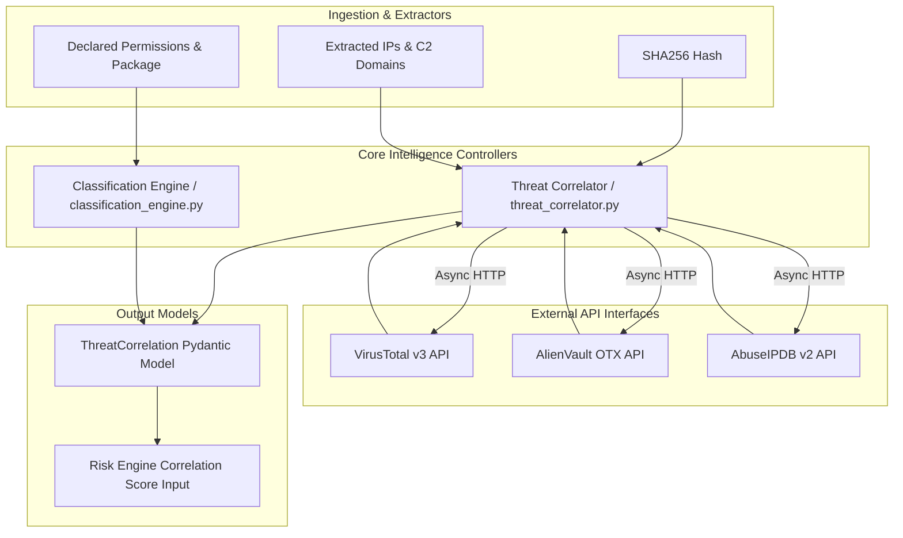
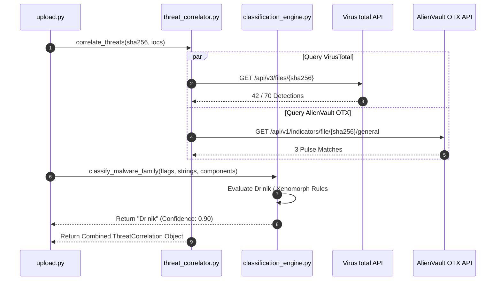

# 07 — Fraud Intelligence Engine & Threat Correlator

## Purpose

The **Fraud Intelligence Engine** correlates locally extracted application indicators (file SHA256 hashes, C2 IP addresses, domain names, certificate serials) against external threat intelligence platforms (VirusTotal, AlienVault OTX, AbuseIPDB). It applies deterministic rule matching to classify the application into known Android banking malware families (*Drinik*, *Xenomorph*, *Cerberus*, *Anubis*, *SpyNote*, *Teabot*, *Hydra*) and computes an external threat correlation score.

---

## Responsibilities

The fraud intelligence engine is responsible for:
1. **External API Querying**: Querying VirusTotal v3 API, AlienVault OTX API, and AbuseIPDB v2 API using asynchronous HTTP requests (`httpx`).
2. **Reputation Aggregation**: Aggregating vendor detection ratios, malicious vendor lists, OTX threat pulses, and IP abuse confidence scores into a unified `ThreatCorrelation` model.
3. **Malware Family Classification**: Executing rule-based pattern matching in `classification_engine.py` against package names, certificate fingerprints, hardcoded strings, and DEX class patterns to identify known banking trojan strains.
4. **Campaign & C2 Attribution**: Linking extracted C2 domain/IP infrastructure to known banking fraud campaigns.

---

## High-Level Overview

Threat correlation operates in parallel with local static and dynamic analysis. When an APK is uploaded, its computed SHA256 hash and extracted C2 domains/IPs are passed to `threat_correlator.py`.

The correlator asynchronously queries external threat databases. Simultaneously, `classification_engine.py` evaluates extracted static/dynamic features against family signatures.

If VirusTotal reports $35/70$ vendor detections and package rules match `com.sbi.lotusintouch` target overlay strings with `AccessibilityService` abuse, the engine classifies the sample as **Drinik Banking Trojan** with high confidence.

```text
[ SHA256 Hash + Extracted IPs/Domains ]
                   │
                   ▼
       [ Threat Correlator ]
      (threat_correlator.py)
                   │
    ┌──────────────┼──────────────┐
    │              │              │
    ▼              ▼              ▼
[ VirusTotal ]  [ OTX ]     [ AbuseIPDB ]
(Hash/IP API) (Pulse API)   (IP API)
    │              │              │
    └──────────────┼──────────────┘
                   │
                   ▼
     [ Classification Engine ]
    (classification_engine.py)
                   │
                   ▼
    [ ThreatCorrelation Output ]
    - Family: Drinik / Cerberus / Xenomorph
    - VT Ratio: 45 / 72
    - Correlation Confidence: 0.85
```

---

## Architecture

The fraud intelligence engine operates within the backend service layer:



---

## Components

Primary modules forming the fraud intelligence engine:

| Component / Module | Source Location | Description & Responsibilities |
| :--- | :--- | :--- |
| `ThreatCorrelator` | `backend/app/services/threat_correlator.py` | Asynchronous API client querying VirusTotal, OTX, and AbuseIPDB. Returns `ThreatCorrelation` schema. |
| `classification_engine.py` | `backend/app/engines/classification_engine.py` | Deterministic rule engine evaluating family signatures (*Drinik*, *Xenomorph*, *Cerberus*, *Anubis*, *SpyNote*). |
| `ThreatCorrelation` | `backend/app/models/schemas.py` | Pydantic schema representing aggregated threat intelligence, vendor ratios, and confidence scores. |
| `IOCReputation` | `backend/app/models/schemas.py` | Pydantic model for individual IOC reputation records (VT malicious count, AbuseIPDB score, country). |

---

## Workflow

Threat correlation execution pipeline:



---

## Data Flow

Data transformation through the fraud intelligence engine:

$$\text{SHA256 Hash + Network IOCs}$$
$$\Downarrow$$
$$\text{Async Parallel REST API Queries } (\text{VirusTotal}, \text{OTX}, \text{AbuseIPDB})$$
$$\Downarrow$$
$$\text{Vendor Detection Ratio Calculation } (\text{VT Ratio} = \frac{\text{Detections}}{\text{Total Vendors}} \cdot 100)$$
$$\Downarrow$$
$$\text{Rule-Based Family Classification Matching } (\text{Package}, \text{Classes}, \text{Intents})$$
$$\Downarrow$$
$$\text{ThreatCorrelation Model } \Rightarrow \text{Risk Engine Input}$$

---

## Algorithms

Family classification and threat scoring rely on deterministic rules:

### 1. Family Signature Matrix
`classification_engine.py` matches extracted binary attributes against known signatures:
- **Drinik**: Package contains `sbi` / `pnb` / `overlay` + Accessibility Service + SMS Interception + Hardcoded C2 path `/drinik/gate.php`.
- **Cerberus**: Uses `SystemAlertWindow` + Accessibility ATS + Dynamic DEX loading + C2 ping payload `/bot/ping`.
- **Xenomorph**: Accessibility automated overlay injection + Telegram C2 channel resolver + Device Admin request.
- **SpyNote**: Remote RAT capabilities + Audio recording + Camera permission + Keylogger socket stream.

### 2. Threat Correlation Score Formula
Computes an external reputation score ($0.0 - 100.0$) feeding directly into the Correlation axis of the FRS risk engine:
$$\text{Correlation Score} = \min\left( (\text{VT Ratio} \cdot 0.70) + (\text{OTX Pulses} \cdot 5.0) + (\text{Abuse Score} \cdot 0.30), 100.0 \right)$$

---

## Integration

The fraud intelligence engine integrates with external services and internal risk scoring:

```text
+--------------------------------------------------------------------------+
|                      FRAUD INTELLIGENCE ENGINE                           |
|                                                                          |
|  +--------------------+      +--------------------+      +-------------+ |
|  | External Threat    |=====>| Threat Correlator  |=====>| Risk Engine | |
|  | APIs (VT/OTX)      |      | Service            |      | (Correlation| |
|  +--------------------+      +---------+----------+      | Axis Input) | |
|                                        |                 +-------------+ |
|                                        v                                 |
|                              +--------------------+                      |
|                              | Classification     |                      |
|                              | Engine             |                      |
|                              +--------------------+                      |
+--------------------------------------------------------------------------+
```

---

## Folder Structure

Source code locations for threat correlation and classification:

```text
backend/app/
├── services/
│   └── threat_correlator.py   <- VirusTotal, OTX, AbuseIPDB Async API Client
├── engines/
│   └── classification_engine.py <- Rule-Based Malware Family Classifier
└── models/
    └── schemas.py             <- ThreatCorrelation & IOCReputation Pydantic Schemas
```

---

## API Reference

Threat intelligence output is embedded within the primary analysis response:

### Threat Correlation Schema Excerpt
```json
{
  "threat_correlation": {
    "available": true,
    "sha256_detections": 38,
    "sha256_total": 71,
    "vt_detection_ratio": 53.52,
    "known_family": "Drinik",
    "campaign": "IN-BANK-2024-Q2",
    "threat_score": 77.46,
    "correlation_confidence": 0.88,
    "sources_queried": ["VirusTotal", "AlienVault OTX", "AbuseIPDB"]
  }
}
```

---

## Configuration

Environment API keys configured in `.env`:

| Variable | Default Value | Description |
| :--- | :--- | :--- |
| `VT_API_KEY` | `""` | VirusTotal v3 REST API key. |
| `OTX_API_KEY` | `""` | AlienVault OTX API key. |
| `ABUSEIPDB_API_KEY` | `""` | AbuseIPDB v2 REST API key. |

---

## Error Handling

1. **Unconfigured API Keys**: If `VT_API_KEY` is empty or unset, `threat_correlator.py` logs an info message (`VT_API_KEY not configured, skipping VT lookup`), sets `available = False`, and assigns a neutral correlation score ($0.0$) without throwing errors.
2. **API Rate Limiting**: If VirusTotal returns HTTP `429 Too Many Requests`, the correlator catches the error, logs a rate-limit warning, and returns partial results from remaining active sources.

---

## Current Implementation Status

| Feature | Status | Operational Details |
| :--- | :--- | :--- |
| **VirusTotal Integration** | **Implemented** | Asynchronous HTTP lookup active in `threat_correlator.py`. |
| **AlienVault OTX Lookup** | **Implemented** | Pulse query active in `threat_correlator.py`. |
| **AbuseIPDB IP Check** | **Implemented** | IP abuse confidence lookup active in `threat_correlator.py`. |
| **Family Classifier** | **Implemented** | Signature rule matching implemented in `classification_engine.py`. |

---

## Current Limitations

1. **API Key Dependency**: Complete external threat correlation requires active, paid/community API keys for VirusTotal, AlienVault OTX, and AbuseIPDB.
2. **Air-Gapped Operation**: In strict offline/air-gapped banking environments without outbound internet access, external API lookups must be disabled, setting correlation score to neutral fallback defaults.

---

## Future Improvements

1. **Local Threat Feed Cache**: Implement local SQLite caching for previously queried SHA256 hashes to minimize external API rate-limit usage.
2. **Offline YARA Hash Database**: Integrate local offline hash sets (e.g., MalwareBazaar hashes) for air-gapped threat correlation.
