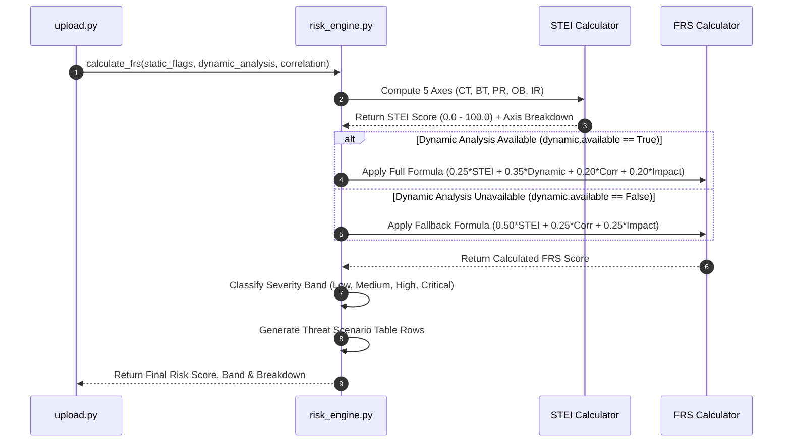

# 08 — Deterministic Risk Engine

## Purpose

The **Deterministic Risk Engine** is the mathematical core of the Sudarshan platform. It evaluates observable evidence collected during static analysis, dynamic execution, and threat intelligence correlation against fixed formulas to produce a single, reproducible **Fraud Risk Score ($FRS$)**, severity band assignment, and granular Threat Scenario Matrix. It guarantees that two identical APK binaries will always yield identical risk scores.

---

## Responsibilities

The risk engine is strictly responsible for:
1. **Enforcing Determinism Invariant**: Ensuring that risk scores are calculated 100% mathematically without stochastic or non-deterministic LLM influence.
2. **Computing 5-Axis STEI**: Calculating the Static Threat and Environmental Index ($STEI$) across Credential Theft, Banking Targeting, Permission Risk, Obfuscation, and Infrastructure Risk axes.
3. **Evaluating BFCI Inputs**: Incorporating the Behavioral Fraud Confidence Index ($BFCI$) when dynamic analysis is available.
4. **Executing FRS Formulas**: Applying weighted formulas to yield the final Fraud Risk Score ($FRS$, range $0.0 - 100.0$) and severity band (`Low`, `Medium`, `High`, `Critical`).
5. **Generating Threat Scenario Table**: Building structured threat scenario rows documenting overlay risk, credential theft risk, C2 risk, persistence risk, evidence traces, and confidence scores.

---

## High-Level Overview

Sudarshan operates on a strict **AI-Downstream Invariant**:

$$\text{Observable Evidence } \longrightarrow \text{Deterministic Risk Engine } (STEI, BFCI, FRS) \longrightarrow \text{Fixed Verdict}$$

Generative AI models are strictly prohibited from calculating, adjusting, or influencing risk scores. When analysis features arrive in `risk_engine.py`, the engine calculates axis scores, weights them according to established mathematical models, and evaluates the final FRS score.

The score maps directly to severity bands and recommended SOC actions:

```text
[ Fraud Risk Score (FRS) Range ]
 0.0                      30.0                     60.0                     85.0                     100.0
 ├────────────────────────┼────────────────────────┼────────────────────────┼────────────────────────┤
 │        LOW             │        MEDIUM          │         HIGH           │        CRITICAL        │
 │  (Monitor Application) │  (Step-Up Auth Alert)  │  (Quarantine & Block)  │ (Immediate Account Lock)│
```

---

## Architecture

The Risk Engine receives structured inputs from static, dynamic, and correlation engines:

```mermaid
graph TD
    subgraph Signal Extractor Inputs
        STAT[Static Analysis Flags<br/>StaticAnalysisFlags Model]
        DYN[Dynamic Analysis Findings<br/>BFCI Component Scores]
        CORR[Threat Correlation<br/>ThreatCorrelation Model]
    end

    subgraph Deterministic Risk Core (risk_engine.py)
        STEI_ENG[5-Axis STEI Calculator]
        FRS_ENG[FRS Formula Processor]
        BAND_ENG[Severity Band Classifier]
        TBL_ENG[Threat Scenario Table Generator]
    end

    subgraph Output Artifacts
        FRS_OUT[Final Fraud Risk Score: 87.5]
        BAND_OUT[Risk Band: CRITICAL]
        BD_OUT[FRS Breakdown Dict]
        TBL_OUT[Threat Scenario Table Rows]
    end

    STAT --> STEI_ENG
    STEI_ENG --> FRS_ENG
    DYN --> FRS_ENG
    CORR --> FRS_ENG

    FRS_ENG --> BAND_ENG
    FRS_ENG --> BD_OUT
    BAND_ENG --> FRS_OUT
    BAND_ENG --> BAND_OUT
    STAT --> TBL_ENG
    DYN --> TBL_ENG
    TBL_ENG --> TBL_OUT
```

---

## Components

Core technical components of the risk engine:

| Component / Function | Location | Description & Responsibilities |
| :--- | :--- | :--- |
| `calculate_frs()` | `backend/app/engines/risk_engine.py` | Primary entrypoint function accepting static, dynamic, and threat correlation dicts. Returns `FRSBreakdown` and final score. |
| `_compute_stei_axes()` | `backend/app/engines/risk_engine.py` | Internal helper computing individual scores across the 5 STEI axes ($CT$, $BT$, $PR$, $OB$, $IR$). |
| `_generate_threat_scenario_table()` | `backend/app/engines/risk_engine.py` | Constructs tabular threat scenario rows detailing credential theft, overlay, C2, and persistence evidence. |
| `FRSBreakdown` | `backend/app/models/schemas.py` | Pydantic schema storing component scores ($STEI$, $BFCI$, $Correlation$, $BankingImpact$) and 5-axis STEI breakdown. |
| `ThreatScenarioRow` | `backend/app/models/schemas.py` | Pydantic model for individual threat scenario matrix rows. |

---

## Workflow

Mathematical evaluation workflow in `risk_engine.py`:



---

## Data Flow

Data transformation during risk evaluation:

$$\text{Raw Binary Signals } (\text{Permissions}, \text{Packages}, \text{Frida Hooks}, \text{VT Ratio})$$
$$\Downarrow$$
$$\text{5-Axis STEI Computation } \Rightarrow STEI = 0.60 \cdot CT + 0.20 \cdot BT + 0.10 \cdot PR + 0.05 \cdot OB + 0.05 \cdot IR$$
$$\Downarrow$$
$$\text{FRS Formula Execution } \Rightarrow FRS = (0.25 \cdot STEI) + (0.35 \cdot Dynamic) + (0.20 \cdot Correlation) + (0.20 \cdot Impact)$$
$$\Downarrow$$
$$\text{Severity Mapping } \Rightarrow \text{Band Assignment } (\text{Critical / High / Medium / Low})$$
$$\Downarrow$$
$$\text{Pydantic Schema Output } (FRSBreakdown, ThreatScenarioRow)$$

---

## Algorithms

The risk engine executes three mathematical algorithms:

### 1. Static Threat and Environmental Index ($STEI$) Formula
$$STEI = (0.60 \cdot CT) + (0.20 \cdot BT) + (0.10 \cdot PR) + (0.05 \cdot OB) + (0.05 \cdot IR)$$

Axis definitions and scoring logic:
- **Credential Theft ($CT$, weight $0.60$)**: Accessibility Service ($+40$), SMS Read/Receive ($+35$), System Alert Window ($+25$). Cap: $100.0$.
- **Banking Targeting ($BT$, weight $0.20$)**: Base $+20$ for any Indian bank package match, $+10$ per additional bank package match. Cap: $100.0$.
- **Permission Risk ($PR$, weight $0.10$)**: Normalized sum of dangerous permissions (`RECEIVE_SMS`, `READ_CONTACTS`, `RECORD_AUDIO`, `CAMERA`).
- **Obfuscation ($OB$, weight $0.05$)**: `DexClassLoader` ($+40$), `System.loadLibrary` ($+20$), Reflection ($+25$), String Entropy $>0.5$ ($+15$). Cap: $100.0$.
- **Infrastructure Risk ($IR$, weight $0.05$)**: $+10$ per hardcoded C2 URL/IP address. Cap: $100.0$.

### 2. Behavioral Fraud Confidence Index ($BFCI$) Formula
$$BFCI = (0.35 \cdot A) + (0.25 \cdot S) + (0.20 \cdot O) + (0.10 \cdot B) + (0.05 \cdot N) + (0.05 \cdot P)$$

### 3. Fraud Risk Score ($FRS$) Formulas
- **Full Dynamic Formula**:
  $$FRS = 0.25 \cdot STEI + 0.35 \cdot BFCI + 0.20 \cdot Correlation + 0.20 \cdot BankingImpact$$
- **Static Fallback Formula**:
  $$FRS = 0.50 \cdot STEI + 0.25 \cdot Correlation + 0.25 \cdot BankingImpact$$

### 4. Severity Band Mapping Matrix
- **Critical**: $FRS \ge 85.0$ $\rightarrow$ Immediate account block & token revocation.
- **High**: $60.0 \le FRS < 85.0$ $\rightarrow$ Fraud team quarantine & manual verification.
- **Medium**: $30.0 \le FRS < 60.0$ $\rightarrow$ Step-up authentication & customer advisory.
- **Low**: $FRS < 30.0$ $\rightarrow$ Standard monitoring.

---

## Integration

The Risk Engine acts as the central evaluation node for the platform:

```text
+--------------------------------------------------------------------------+
|                       DETERMINISTIC RISK ENGINE                          |
|                                                                          |
|  +--------------------+      +--------------------+      +-------------+ |
|  | Static Analysis    |=====>| risk_engine.py     |=====>| Executive & | |
|  | Flags              |      | calculate_frs()    |      | Technical   | |
|  +--------------------+      +---------+----------+      | Dashboards  | |
|                                        |                 +-------------+ |
|                                        v                                 |
|                              +--------------------+                      |
|                              | Gemini RAG Index   |                      |
|                              | (gemini_rag.py)    |                      |
|                              +--------------------+                      |
+--------------------------------------------------------------------------+
```

---

## Folder Structure

Risk engine source code and test baselines:

```text
backend/app/
├── engines/
│   └── risk_engine.py          <- Core Mathematical Risk Engine Implementation
├── models/
│   └── schemas.py              <- FRSBreakdown & ThreatScenarioRow Schemas
└── tests/
    ├── test_risk_engine.py     <- Unit Tests for STEI, BFCI, and FRS Formulas
    ├── determinism_baseline.json <- Pinned Determinism Replay Baselines (9 Tests)
    └── test_determinism.py    <- Baseline Replay Test Runner
```

---

## API Reference

Risk scores are returned within the primary `AnalysisResponse` object:

### FRS Score JSON Response Excerpt
```json
{
  "final_risk_score": 88.75,
  "risk_band": "CRITICAL",
  "confidence": 0.92,
  "recommended_action": "IMMEDIATE ACCOUNT BLOCK & TOKEN REVOCATION",
  "frs_breakdown": {
    "stei": 92.50,
    "dynamic": 0.0,
    "correlation": 85.0,
    "banking_impact": 100.0,
    "formula_used": "static_fallback",
    "dynamic_available": false,
    "stei_axes": {
      "ct": 100.0,
      "bt": 80.0,
      "pr": 60.0,
      "ob": 40.0,
      "ir": 30.0
    }
  }
}
```

---

## Configuration

Risk weights are hardcoded as deterministic mathematical invariants in `risk_engine.py` to prevent accidental configuration drift.

---

## Error Handling

1. **Missing Signal Defaults**: If a static or dynamic input dictionary contains missing or null keys, `risk_engine.py` uses explicit `get(key, default)` calls to substitute neutral zero values without failing.
2. **Score Clamping**: All calculated sub-scores and final FRS values are passed through `max(0.0, min(score, 100.0))` to guarantee strict bounds between $0.0$ and $100.0$.

---

## Current Implementation Status

| Feature | Status | Operational Details |
| :--- | :--- | :--- |
| **5-Axis STEI Formula** | **Implemented** | $CT$, $BT$, $PR$, $OB$, $IR$ axes implemented in `risk_engine.py`. |
| **BFCI Evaluation** | **Implemented** | $BFCI$ component weighting implemented in `risk_engine.py`. |
| **Full / Fallback FRS Rules** | **Implemented** | Dynamic and static fallback formulas fully operational. |
| **Determinism Baselines** | **Implemented** | 9 pinned determinism replay tests passing in `backend/tests/`. |

---

## Current Limitations

1. **Fixed Weight Calibration**: Formula weights ($0.60 CT$, $0.20 BT$, etc.) are statically defined; dynamic machine-learned weight recalibration is not implemented to preserve determinism.
2. **Static Fallback Reliance**: Due to current Frida AVD event silence, the risk engine consistently executes the static fallback formula in production environments.

---

## Future Improvements

1. **Configurable Weight Profiles**: Allow regulatory administrators to adjust formula weights via signed policy configuration files.
2. **Multi-Jurisdiction Targeting**: Expand Banking Targeting ($BT$) package registries to support international banking apps beyond India.
