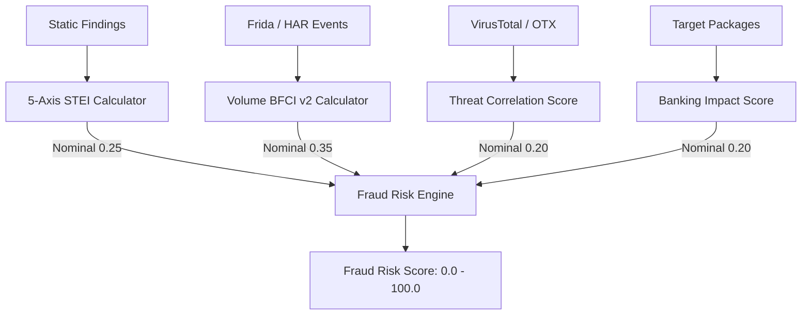

# 08 — Deterministic Risk Engine Specification

```yaml
Module Title:        Deterministic Risk Engine & Mathematical Models
Version:             2.5.0-STABLE
Primary Files:       shared/sudarshan_core/engines/risk_engine.py
                     shared/sudarshan_core/engines/bfci_scorer.py
Test Suite:          backend/tests/test_risk_engine.py, backend/tests/test_bfci_scorer.py
```

---

## Table of Contents
- [1. Executive Overview](#1-executive-overview)
- [2. Mathematical Scoring Formulas](#2-mathematical-scoring-formulas)
- [3. Static Threat Exposure Index (STEI)](#3-static-threat-exposure-index-stei)
- [4. Behavioral Fraud Confidence Index (BFCI v2)](#4-behavioral-fraud-confidence-index-bfci-v2)
- [5. Fraud Risk Score (FRS)](#5-fraud-risk-score-frs)
- [6. Static Risk Fallback Engine](#6-dynamic-axis-exclusion-static-only-and-inconclusive-runs)
- [7. Threat Scenario Correlation Matrix](#7-threat-scenario-correlation-matrix)

---

## 1. Executive Overview

The **Deterministic Risk Engine** ([`risk_engine.py`](file:///d:/Projects/Sudarshan%20BOI/shared/sudarshan_core/engines/risk_engine.py)) provides the core mathematical risk scoring logic of the Sudarshan platform. To maintain regulatory compliance and auditability, numerical risk scores ($0.0 - 100.0$) are derived strictly from mathematical formulas and observable evidence—never from LLM predictions.

---

## 2. Mathematical Scoring Formulas



---

## 3. Static Threat Exposure Index (STEI)

$$STEI = 0.60 \times CT + 0.20 \times BT + 0.10 \times PR + 0.05 \times OB + 0.05 \times IR$$

- **Credential Theft ($CT$)**: Accessibility, SMS, and Overlay abuse ($0.0 - 1.0$).
- **Banking Targeting ($BT$)**: Matches against 47 Indian banking apps ($0.0 - 1.0$).
- **Permission Risk ($PR$)**: Ratio of requested dangerous permissions ($0.0 - 1.0$).
- **Obfuscation ($OB$)**: Shannon entropy ratio of classes.dex & reflection usage ($0.0 - 1.0$).
- **Infrastructure Risk ($IR$)**: Malicious C2 domains and hardcoded IP addresses ($0.0 - 1.0$).

---

## 4. Behavioral Fraud Confidence Index (BFCI v2)

Calculated in [`bfci_scorer.py`](file:///d:/Projects/Sudarshan%20BOI/shared/sudarshan_core/engines/bfci_scorer.py) using logarithmic volume scaling and temporal sequence bonuses:

$$BFCI_{\text{v2}} = \min\left(100.0, \sum_{c} W_c \cdot \min\left(1.0, \frac{\ln(1 + N_c)}{\ln(1 + M_c)}\right) \times 100 + S_{\text{sequence}}\right)$$

- **Category Weights ($W_c$)**: Accessibility (0.35), SMS (0.25), Overlay (0.20), Banking (0.10), Network (0.05), Persistence (0.05).
- **Sequence Bonus ($S_{\text{sequence}}$)**: $+15.0$ points when a causal sequence (e.g., Overlay $\rightarrow$ SMS Intercept) executes within 30 seconds.

---

## 5. Fraud Risk Score (FRS)

[`calculate_risk_score`](../../shared/sudarshan_core/engines/risk_engine.py) uses **nominal** axis weights that **renormalize** over only the axes that have data. An absent axis is excluded (not scored as zero).

| Axis | Nominal weight | Included when |
| :--- | :--- | :--- |
| `stei` | 0.25 | Always (static analysis ran) |
| `dynamic` | 0.35 | Dynamic run was **conclusive** (`dynamic_conclusive`) |
| `correlation` | 0.20 | Threat-intel correlation returned `available: true` |
| `banking_impact` | 0.20 | Always |

$$\text{base\_frs} = \frac{\sum_{a \in \text{live}} w_a \cdot s_a}{\sum_{a \in \text{live}} w_a}$$

$$\text{final\_risk\_score} = \min(\text{base\_frs} \times \text{ai\_confidence\_multiplier}, 100.0)$$

The `ai_confidence_multiplier` is rule-derived (family classifier / correlation), clamped to `[0.5, 1.5]` — not LLM output.

Response field `frs_breakdown.axes_used` lists the **renormalized** weights; `axes_excluded` lists omitted axes.

| Final score (after multiplier) | Risk band (`risk_engine.py`) | UI label |
| :--- | :--- | :--- |
| **0.0 – 30.0** | `Safe` | Safe |
| **30.1 – 60.0** | `Suspicious` | Suspicious |
| **60.1 – 89.0** | `High Risk` | High |
| **≥ 90.0** | `Critical` | Critical |

**Visibility floor:** If the band would be `Safe`, the sample has a concealed payload (`has_concealed_payload`), and dynamic analysis did not run conclusively, the band is raised to `Suspicious` (`verdict_floored_for_visibility`).

---

## 6. Dynamic axis exclusion (static-only and inconclusive runs)

There is no separate fixed-weight “static fallback” formula. When dynamic analysis is unavailable or **inconclusive** (sandbox ran but captured no observable behavior), the `dynamic` axis is excluded and the remaining weights renormalize — the same mechanism used when threat-intel keys are unset and `correlation` is excluded.

---

## 7. Threat Scenario Correlation Matrix

Maps extracted flags directly to threat scenarios in the response:

```python
class ThreatScenarioRow(BaseModel):
    indicator: str            # e.g. "Accessibility Service"
    threat_scenario: str      # e.g. "OTP Harvesting via UI Scraping"
    overlay_risk: str         # High / Medium / Low / N/A
    credential_theft_risk: str
    c2_risk: str
    persistence_risk: str
    evidence: str
    confidence: int           # 0–100
```
