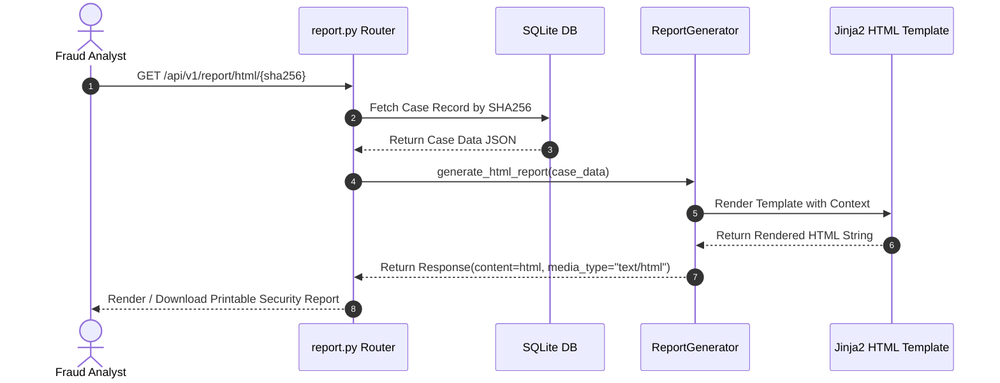

# 09 — AI Report Generation & Intelligence Export Engine

## Purpose

The **AI Report Generation & Intelligence Export Engine** compiles verified static, dynamic, threat intelligence, risk score, and AI narrative outputs into multi-format, enterprise-grade reporting artifacts. It generates printable Jinja2 HTML security reports, standardized STIX 2.1 JSON threat intelligence bundles for SIEM/SOAR ingestion, and CSV Indicator of Compromise (IOC) feeds for automated firewall/proxy blocking.

---

## Responsibilities

The report generation engine is specifically responsible for:
1. **HTML Security Report Templating**: Rendering standalone, printable HTML threat intelligence reports using Jinja2 templates (`report_generator.py`).
2. **STIX 2.1 Threat Bundle Export**: Serializing threat indicators, malware family classifications, identity objects, and relationships into STIX 2.1 JSON format using the official `stix2` Python library.
3. **CSV IOC Export**: Formatting extracted IP addresses, domain names, file hashes, and wallet addresses into CSV files for perimeter defense ingestion.
4. **Advisory Generation**: Formatting CERT-In regulatory advisories, executive summaries, SOC mitigation actions, and customer advisory drafts.

---

## High-Level Overview

Reporting occurs at the conclusion of the analysis pipeline. When an analyst requests a report download via the REST API or Dashboard, `report.py` invokes the corresponding export handler.

For HTML reports, `ReportGenerator` injects case data into a responsive Jinja2 template featuring embedded CSS styles, severity badges, risk score breakdowns, threat scenario tables, and customer advisory drafts.

For STIX 2.1 bundles, `stix2` constructs an immutable graph linking the `Malware` object to `Indicator` objects, `ObservedData` objects, and `CourseOfAction` objects.

```text
[ Analysis Case Record (sudarshan.db) ]
                  │
                  ▼
      [ Report Route Controller ]
       (app/routes/report.py)
                  │
    ┌─────────────┼─────────────┐
    │             │             │
    ▼             ▼             ▼
[ Jinja2 HTML ] [ STIX 2.1 ]  [ CSV Feed ]
Generator       Exporter      Exporter
    │             │             │
    ▼             ▼             ▼
 Printable      SIEM / SOAR   Firewall
 Security       JSON Bundle   IOC Feed
 Report         (stix2)       (.csv)
```

---

## Architecture

The report generation engine serves as the final delivery tier in the backend:

```mermaid
graph TD
    subgraph Data Store & Analysis
        CASE[Case Record / sudarshan.db]
        RESP[AnalysisResponse Model]
    end

    subgraph Export Controller (report.py)
        ROUTE_HTML[GET /api/v1/report/html/{sha256}]
        ROUTE_STIX[GET /api/v1/report/stix/{sha256}]
        ROUTE_CSV[GET /api/v1/report/csv/{sha256}]
    end

    subgraph Report Engines
        JINJA[Jinja2 HTML Generator<br/>report_generator.py]
        STIX_ENG[STIX 2.1 Bundle Builder<br/>stix2 Python Library]
        CSV_ENG[CSV Serialization Writer]
    end

    subgraph Output Artifacts
        HTML_DOC[Printable HTML Security Report]
        STIX_DOC[STIX 2.1 JSON Intelligence Bundle]
        CSV_DOC[CSV IOC Feed File]
    end

    CASE --> RESP
    RESP --> ROUTE_HTML
    RESP --> ROUTE_STIX
    RESP --> ROUTE_CSV

    ROUTE_HTML --> JINJA
    ROUTE_STIX --> STIX_ENG
    ROUTE_CSV --> CSV_ENG

    JINJA --> HTML_DOC
    STIX_ENG --> STIX_DOC
    CSV_ENG --> CSV_DOC
```

---

## Components

Primary technical components of the reporting engine:

| Component / Module | Source Location | Description & Responsibilities |
| :--- | :--- | :--- |
| `report.py` | `backend/app/routes/report.py` | FastAPI router endpoints handling HTML, STIX 2.1, and CSV export requests. |
| `ReportGenerator` | `backend/app/engines/report_generator.py` | Jinja2 environment manager rendering HTML security report templates. |
| `stix2` Library | External Dependency | Official OASIS STIX 2.1 Python SDK constructing `Bundle`, `Malware`, `Indicator`, and `Identity` SDOs. |
| `csv` Writer | Standard Library | Python `csv.DictWriter` generating CSV files containing extracted IOCs. |

---

## Workflow

HTML report generation sequence:



---

## Data Flow

Data transformation during report serialization:

$$\text{Persisted Case JSON } (\text{AnalysisResponse})$$
$$\Downarrow$$
$$\text{Export Format Selection } (\text{HTML}, \text{STIX 2.1}, \text{CSV})$$
$$\Downarrow$$
$$\text{Serialization Processing: Jinja2 Context Injection / STIX SDO Object Graph Construction}$$
$$\Downarrow$$
$$\text{HTTP Stream Delivery } (\text{text/html}, \text{application/json}, \text{text/csv})$$

---

## Algorithms

The engine maps Sudarshan internal models into standardized STIX 2.1 Cyber Threat Intelligence (CTI) objects:

### STIX 2.1 Object Graph Mapping
1. **Identity SDO**:
   - `name`: "Sudarshan Banking Threat Intelligence Platform"
   - `identity_class`: "system"
2. **Malware SDO**:
   - `name`: Matched malware family (e.g., "Drinik") or package name.
   - `is_family`: `true`
   - `malware_types`: `["malicious-activity", "banking-trojan"]`
3. **Indicator SDOs**:
   - SHA256 File Hash Indicator (`pattern`: `[file:hashes.'SHA-256' = '...']`).
   - C2 IP Address Indicator (`pattern`: `[ipv4-addr:value = '...']`).
   - C2 Domain Name Indicator (`pattern`: `[domain-name:value = '...']`).
4. **Course of Action SDO**:
   - `name`: Recommended SOC mitigation action (e.g., "Quarantine & Revoke Tokens").

---

## Integration

The report generation engine connects database records to external security systems:

```text
+--------------------------------------------------------------------------+
|                       AI REPORT GENERATION ENGINE                        |
|                                                                          |
|  +--------------------+      +--------------------+      +-------------+ |
|  | Case Record        |=====>| report.py Router   |=====>| SIEM / SOAR | |
|  | (sudarshan.db)     |      | Exporters          |      | Connectors  | |
|  +--------------------+      +---------+----------+      | (STIX 2.1)  | |
|                                        |                 +-------------+ |
|                                        v                                 |
|                              +--------------------+                      |
|                              | Printable HTML     |                      |
|                              | Security Report    |                      |
|                              +--------------------+                      |
+--------------------------------------------------------------------------+
```

---

## Folder Structure

Source code locations for reporting:

```text
backend/app/
├── routes/
│   └── report.py               <- Report Export Endpoints (HTML, STIX, CSV, SSE Chat)
├── engines/
│   └── report_generator.py     <- Jinja2 HTML Report Generator Implementation
└── templates/
    └── report_template.html    <- Base Jinja2 HTML Report Template
```

---

## API Reference

Export endpoints exposed by `report.py`:

| Method | Endpoint | Response Media Type | Description |
| :--- | :--- | :--- | :--- |
| `GET` | `/api/v1/report/html/{sha256}` | `text/html` | Download printable Jinja2 HTML security report. |
| `GET` | `/api/v1/report/stix/{sha256}` | `application/json` | Download STIX 2.1 threat intelligence JSON bundle. |
| `GET` | `/api/v1/report/csv/{sha256}` | `text/csv` | Download extracted IOCs in CSV format. |

---

## Configuration

Jinja2 template options configured in `report_generator.py`:
- `autoescape = True` (Prevents HTML injection in report text).
- `trim_blocks = True`, `lstrip_blocks = True` (Optimizes whitespace rendering).

---

## Error Handling

1. **Case Not Found**: Requesting a report for an invalid or non-existent SHA256 hash returns an HTTP `404 Not Found` (`Case record not found`).
2. **Template Missing**: If `report_template.html` is missing, `report_generator.py` catches `jinja2.TemplateNotFound` and returns a clean fallback HTML string containing core findings.

---

## Current Implementation Status

| Feature | Status | Operational Details |
| :--- | :--- | :--- |
| **Jinja2 HTML Generator** | **Implemented** | Functional in `report_generator.py` with custom styling. |
| **STIX 2.1 JSON Exporter**| **Implemented** | Serializes CTI bundles using `stix2` Python SDK. |
| **CSV IOC Feed Exporter** | **Implemented** | Generates standard CSV file attachments via `report.py`. |

---

## Current Limitations

1. **PDF Export Deprecation**: PDF report generation via `WeasyPrint` / `pdfkit` was removed to simplify backend dependencies; HTML reports provide a built-in browser print-to-PDF layout (`@media print`).
2. **Single-Case STIX Scope**: STIX export bundles contain indicators for a single case rather than multi-case campaign graphs.

---

## Future Improvements

1. **Custom HTML Branding**: Allow banking clients to customize report CSS headers and bank logos.
2. **MISP Threat Sharing Integration**: Add direct REST API export to MISP (Malware Information Sharing Platform) instances.
