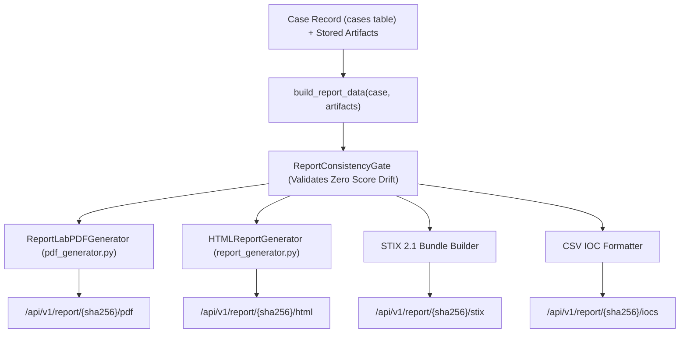

# 09 — Security Report Generation & Export Specification

> **Authoritative Technical Specification**  
> **Source Repository**: `SanTiwari07/Sudarshan`  
> **Last Verified Against Active Codebase**: 2026-08-25  

```yaml
Module Title:        Security Report Generation & Threat Export Engine
Version:             2.1.0
Primary Files:       shared/sudarshan_core/engines/pdf_generator.py
                     shared/sudarshan_core/engines/report_generator.py
                     backend/app/routes/report.py
Test Suite:          backend/tests/test_pdf_generator.py, backend/tests/test_report_generator.py
```

---

## 1. Executive Overview

The **Security Report Generation Engine** compiles complete case findings, deterministic risk scores, MITRE ATT&CK mappings, threat intelligence, and runtime screenshots into multi-format threat reports:
1. **ReportLab Enterprise PDF Dossier** ([`pdf_generator.py`](file:///d:/Projects/Sudarshan%20BOI/shared/sudarshan_core/engines/pdf_generator.py)): High-density multi-page executive and technical PDF reports with vector gauges, bar meters, and screenshot galleries.
2. **Standalone HTML Security Report** ([`report_generator.py`](file:///d:/Projects/Sudarshan%20BOI/shared/sudarshan_core/engines/report_generator.py)): Single-file self-contained HTML report with interactive styling.
3. **STIX 2.1 JSON Bundle** (`backend/app/routes/report.py`): Structured cyber threat intelligence format for automated ingestion by SIEM/SOAR platforms.
4. **CSV / Plaintext IOC Feed** (`backend/app/routes/report.py`): Tabular export of extracted high-confidence malicious domains, IPs, URLs, and file hashes.

---

## 2. Real-Data Pipeline & Provenance Model



### Zero-Fabrication Invariant:
* The report generators never invent or estimate metrics. Every score, timestamp, hook count, and evidence line is mapped directly from authoritative case payloads and `evidence.json`.
* **Consistency Gate**: Verifies `UI FRS == API FRS == PDF FRS == Risk Band`.

---

## 3. PDF Generation Architecture (`pdf_generator.py`)

* **Vector Flowables**:
  - `FRSDialGauge`: 180° semi-circular gauge displaying the final FRS score and Risk Band color.
  - `FRSBarMeter`: 4-axis horizontal progress bar for STEI, Dynamic, Correlation, and Banking Impact.
  - `STEIBarMeter`: 5-axis static exposure meter (CT, BT, PR, OB, IR).
  - `VIDEBarMeter`: Visual clone comparison meter with threshold indicator.
* **12-Section Dossier Layout**:
  1. Executive Summary, FRS Dial, and Family Attribution Card.
  2. Plain-English Narrative, Recommended SOC Actions, and CERT-In Advisories.
  3. Deterministic Score Ledger and FRS Formula Breakdown.
  4. 5-Axis STEI Static Threat Breakdown.
  5. Static Forensic Evidence, Declared & Dangerous Permissions.
  6. Static Evidence $\rightarrow$ MITRE Technique $\rightarrow$ Fraud Impact Matrix.
  7. Attack & Dynamic Behavior Analysis, Reconstructed Fraud Workflow.
  8. Frida Hook Bundle Inventory & Hit Counters.
  9. VIDE Visual Impersonation & Certificate Verification.
  10. External Threat Intelligence Correlation & Scenario Matrix.
  11. Audit Ledger, Coverage, & Limitation Disclaimers.
  12. Indicators of Compromise (IOC) Split & Chain of Custody Sign-Off.
  13. Appendix: High-Resolution Runtime Screenshot Gallery with Captions.

---

## 4. API Endpoints & Export Routes

* `GET /api/v1/report/{sha256}/pdf`: Generates and serves the ReportLab PDF binary stream (`application/pdf`). Requires Bearer token.
* `GET /api/v1/report/{sha256}/html`: Serves standalone single-file HTML report (`text/html`).
* `GET /api/v1/report/{sha256}/stix`: Exports case indicators as a STIX 2.1 JSON bundle (`application/json`).
* `GET /api/v1/report/{sha256}/iocs`: Exports high-confidence IOCs as CSV (`text/csv`).
* `GET /api/v1/report/{sha256}/json`: Returns raw cached JSON report data.
