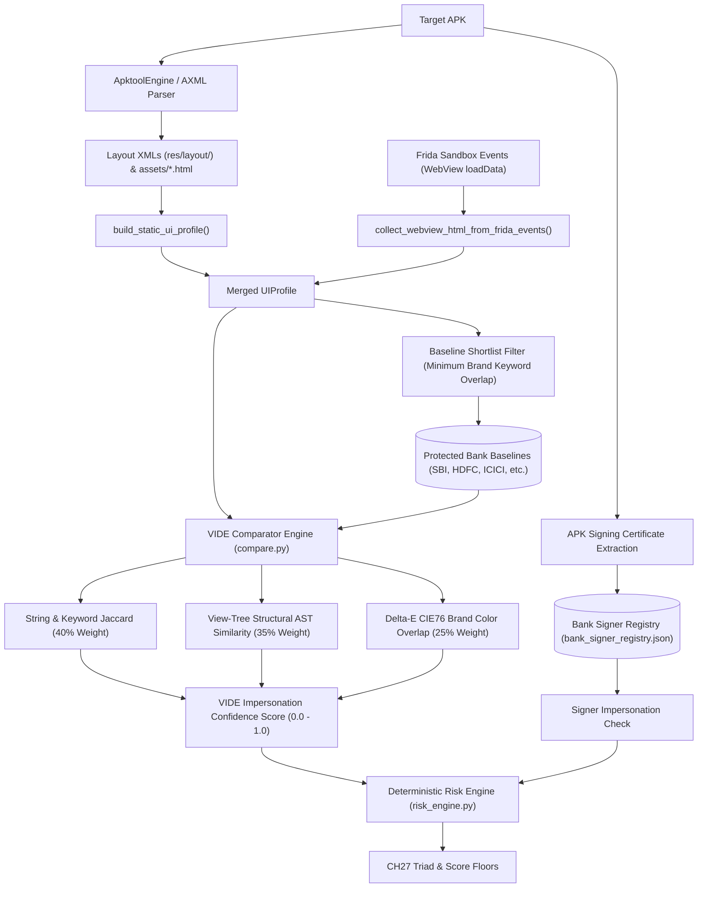

# VIDE — Visual Impersonation Detection Engine Specification

> **Authoritative Technical Specification**  
> **Source Repository**: `SanTiwari07/Sudarshan`  
> **Last Verified Against Active Codebase**: 2026-08-25  

```yaml
Module Title:        Visual Impersonation Detection Engine (VIDE)
Version:             2.1.0
Primary Files:       shared/sudarshan_core/engines/vide/pipeline.py
                     shared/sudarshan_core/engines/vide/ast_builders.py
                     shared/sudarshan_core/engines/vide/color_match.py
                     shared/sudarshan_core/engines/vide/fuzzy.py
                     shared/sudarshan_core/engines/vide/signer_registry.py
                     shared/sudarshan_core/engines/vide/baseline_store.py
                     shared/sudarshan_core/engines/vide/ui_profile.py
                     backend/app/routes/baselines.py
Test Suite:          tests/unit/test_vide_*.py (12 test suites), backend/tests/test_baselines_api.py
```

---

## 1. Executive Overview

**VIDE** is a deterministic, pre-execution and runtime visual forensic engine designed to detect phishing and brand impersonation attacks targeting Indian financial institutions (such as State Bank of India, HDFC Bank, ICICI Bank, Punjab National Bank, Bank of India, Axis Bank).

VIDE extracts structural view ASTs, layout resource hierarchies, embedded HTML/WebView assets, and dominant brand color palettes, cross-referencing them against registered bank baselines and developer signing certificates.

**No LLM determines whether VIDE fires.** All clone detections, color delta scores, and risk escalations are deterministic.

---

## 2. VIDE Pipeline & Forensic Architecture



---

## 3. Comparative Similarity Scoring Model

The composite visual impersonation score is calculated in `shared/sudarshan_core/engines/vide/compare.py`:

$$\text{Confidence} = 0.40 \times S_{\text{strings}} + 0.35 \times S_{\text{tree}} + 0.25 \times S_{\text{color}}$$

* **String & Keyword Jaccard ($S_{\text{strings}}$, 40%)**: Compares UI labels, buttons, and brand keywords against the official baseline vocabulary using fuzzy matching.
* **View-Tree Structural AST ($S_{\text{tree}}$, 35%)**: Compares the hierarchical arrangement of inputs, buttons, and containers (`ast_builders.py`).
* **Delta-E CIE76 Brand Color Overlap ($S_{\text{color}}$, 25%)**: Computes Euclidean color distance in CIE $L^*a^*b^*$ space between extracted hex colors and official brand palettes (`color_match.py`).
* **Detection Threshold**: A clone is flagged (`VIDE-F001`) when $\text{Confidence} \ge 0.20$ **and** at least one *discriminating* axis carries evidence ($S_{\text{strings}} \ge 0.02$ or $S_{\text{colour}} \ge 0.10$).
* **Structure is never sufficient.** $S_{\text{tree}}$ is worth 0.35 of the confidence score, so at a 0.20 threshold any app with a login-shaped layout would clear the bar on structure alone - a device settings screen scored 0.21 against the SBI baseline during calibration. Every banking app shares that skeleton, so it establishes *shape* and cannot establish *identity*. $S_{\text{tree}} \ge 0.10$ is reported as corroboration only.
* **String axis strictness**: short alphabetic tokens are credential names, not
  words. A suspect offering a *confusable substitute* for one (`MPIN` where the
  baseline says `IPIN`) is not a match; one that merely *omits* a qualifier
  (`MPIN` for `6-digit MPIN`) still is.
* **String axis weighting**: each baseline label is weighted by inverse document
  frequency across the baseline set, so a bank's own name outweighs banking
  vocabulary every bank ships. Attribution is decided by what discriminates.
* **Confidence tiers**: because detection spans 0.20-1.00, a verdict carries a band - high ($\ge 0.60$), moderate ($0.35$-$0.59$), low/suspicious ($0.20$-$0.34$) - so the UI and the PDF do not render a weak match and a pixel-faithful clone identically.

---

## 3a. Multi-Tier Matching — *which* bank

Confidence answers "how completely does this app reproduce a baseline". It cannot answer "which of the ten banks", because the banking baseline corpus is built to a deliberately shared schema (`APP_CORPUS_SCHEMA` §3, §4, §7) and the shipped `fingerprints.json` files take that to its limit: **all ten baselines declare the same ten `exactStrings` and the same three structural signatures**, and their brand palettes collide across banks at $\Delta E_{2000} \approx 0$ (BOI `#f26522` is bit-identical to BOB's; ICICI `#f37021` sits $\Delta E$ 0.0 from BOI's orange; PNB and INDUS agree to 0.5).

Scoring those axes at face value gives every bank the same number and names whichever wins by a rounding error. Attribution therefore runs on a separate, tiered score in `corpus_compare.py`, over weights derived from the corpus itself in `discriminative.py`:

$$w(f) = \frac{1/\mathrm{df}(f) - 1/n}{1 - 1/n}$$

for a feature carried by $\mathrm{df}$ of the corpus's $n$ baselines. A feature every baseline carries is worth **exactly zero**, so the shared template strings and shared signatures drop out arithmetically rather than being excluded by a hand-kept list. Colour `df` is counted over $\Delta E_{2000}$ neighbourhoods, not hex equality, or two spellings of the same orange each score as unique.

| Tier | Question | Notes |
| :--- | :--- | :--- |
| **0 — Shape** | Is this a banking UI at all? | Bank-independent. Gates detection, never attributes. |
| **1 — Identity** (0.50) | Does the suspect carry the bank's *name*? | Names are exclusive by construction. Scored as coverage of the bank's **readable** names (package aliases never dilute the denominator) times a repetition factor, because a clone renders a name on several screens while mock payee data mentions an unrelated bank once. |
| **2 — Discriminative labels** (0.30) | Labels this bank ships and its peers do not. | Zero against the shipped corpus; non-zero the moment the corpus carries per-bank text. |
| **3 — Discriminative palette** (0.20) | Brand colours, weighted by rarity. | Graded on a tighter curve than $S_{\text{color}}$ — zero by $\Delta E$ 8 rather than 18, because the corpus palettes are themselves only $\Delta E$ 4-6 apart. |

**Naming an institution requires all four of**: the shape gate cleared; confidence $\ge 0.20$; a $\ge 0.15$ relative margin over the runner-up on the attribution score; and **at least one exclusive feature** — something no other baseline carries, with colours counting only when actually reproduced ($\Delta E \le 2.3$), not approximated. The corroboration requirement is what a margin alone cannot supply: a lead computed over indistinguishable candidates is not evidence.

Falling short is not a non-detection. The verdict is marked ambiguous with an `ambiguity_reason` (`margin` or `no_exclusive_evidence`) and a candidate list, which the pipeline reports as `visual_impersonation_unattributed` at MEDIUM. Every attribution also carries the `conflicting_evidence` and `limitations` fields the corpus registration pipeline mandates.

Measured over the ten reference APKs: attribution went from 7/10 correct — with BOI ranking *behind* Union Bank and ICICI, and ICICI, BOI and UNION unattributable — to **10/10 with margins of 0.26-0.79** (previously 0.006-0.28).

---

## 4. Deterministic Risk Escalations & The CH27 Triad

VIDE findings directly influence the FRS risk calculation in `shared/sudarshan_core/engines/risk_engine.py`:

| Escalation Rule | Condition | FRS Impact | Risk Band |
| :--- | :--- | :--- | :--- |
| **CH27 On-Device Fraud Triad** | Visual Clone ($\text{conf} > 0.85$) + Signer Mismatch + `BIND_ACCESSIBILITY_SERVICE` | Floored to $\ge 95.0$ | **`Critical`** |
| **Signer Impersonation** | Visual match claiming protected institution with unauthorized certificate | Floored to $\ge 92.0$ | **`Critical`** |
| **Critical Visual Cluster** | Visual Clone ($\text{conf} \ge 0.80$) + High-risk static capability (SMS/Overlay) | Floored to $\ge 88.0$ | **`Critical`** |
| **Visual Clone Only** | Visual similarity without signer mismatch or high-risk capability | Capped toward $\sim 75.0$ | **`High Risk`** |

---

## 5. Baselines & Bank Signer Registry

* **UI Baselines**: Stored in `shared/sudarshan_core/data/ui_baselines/*.json`. Baselines are cached in-process at startup and can be reloaded via `POST /api/v1/baselines/refresh`.
* **Bank Signer Registry**: Stored in `shared/sudarshan_core/data/bank_signer_registry.json`. Maps official package names to legitimate SHA-256 certificate fingerprints.
