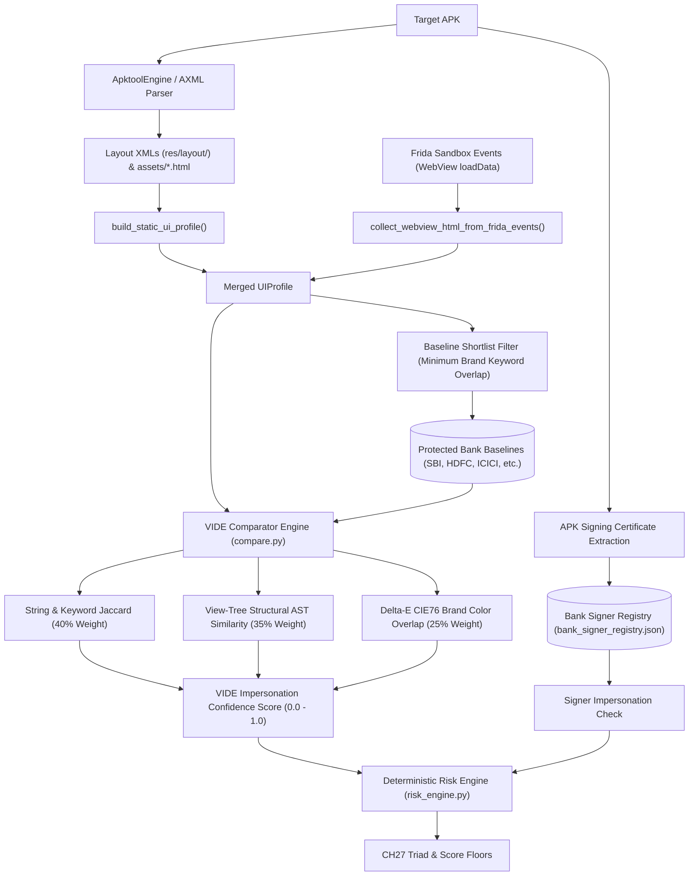

# VIDE — Visual Impersonation Detection Engine Specification

> **Authoritative Technical Specification**  
> **Source Repository**: `SanTiwari07/Sudarshan`  
> **Last Verified Against Active Codebase**: 2026-08-25  

```yaml
Module Title:        Visual Impersonation Detection Engine (VIDE)
Version:             2.1.0
Primary Files:       shared/sudarshan_core/engines/vide/pipeline.py
                     shared/sudarshan_core/engines/vide/ast_builders.py
                     shared/sudarshan_core/engines/vide/color_match.py
                     shared/sudarshan_core/engines/vide/fuzzy.py
                     shared/sudarshan_core/engines/vide/signer_registry.py
                     shared/sudarshan_core/engines/vide/baseline_store.py
                     shared/sudarshan_core/engines/vide/ui_profile.py
                     backend/app/routes/baselines.py
Test Suite:          tests/unit/test_vide_*.py (12 test suites), backend/tests/test_baselines_api.py
```

---

## 1. Executive Overview

**VIDE** is a deterministic, pre-execution and runtime visual forensic engine designed to detect phishing and brand impersonation attacks targeting Indian financial institutions (such as State Bank of India, HDFC Bank, ICICI Bank, Punjab National Bank, Bank of India, Axis Bank).

VIDE extracts structural view ASTs, layout resource hierarchies, embedded HTML/WebView assets, and dominant brand color palettes, cross-referencing them against registered bank baselines and developer signing certificates.

**No LLM determines whether VIDE fires.** All clone detections, color delta scores, and risk escalations are deterministic.

---

## 2. VIDE Pipeline & Forensic Architecture



---

## 3. Comparative Similarity Scoring Model

The composite visual impersonation score is calculated in `shared/sudarshan_core/engines/vide/compare.py`:

$$\text{Confidence} = 0.40 \times S_{\text{strings}} + 0.35 \times S_{\text{tree}} + 0.25 \times S_{\text{color}}$$

* **String & Keyword Jaccard ($S_{\text{strings}}$, 40%)**: Compares UI labels, buttons, and brand keywords against the official baseline vocabulary using fuzzy matching.
* **View-Tree Structural AST ($S_{\text{tree}}$, 35%)**: Compares the hierarchical arrangement of inputs, buttons, and containers (`ast_builders.py`).
* **Delta-E CIE76 Brand Color Overlap ($S_{\text{color}}$, 25%)**: Computes Euclidean color distance in CIE $L^*a^*b^*$ space between extracted hex colors and official brand palettes (`color_match.py`).
* **Detection Threshold**: A clone is flagged (`VIDE-F001`) when $\text{Confidence} \ge 0.72$ and ($S_{\text{strings}} \ge 0.08$ or $S_{\text{tree}} \ge 0.35$).

---

## 4. Deterministic Risk Escalations & The CH27 Triad

VIDE findings directly influence the FRS risk calculation in `shared/sudarshan_core/engines/risk_engine.py`:

| Escalation Rule | Condition | FRS Impact | Risk Band |
| :--- | :--- | :--- | :--- |
| **CH27 On-Device Fraud Triad** | Visual Clone ($\text{conf} > 0.85$) + Signer Mismatch + `BIND_ACCESSIBILITY_SERVICE` | Floored to $\ge 95.0$ | **`Critical`** |
| **Signer Impersonation** | Visual match claiming protected institution with unauthorized certificate | Floored to $\ge 92.0$ | **`Critical`** |
| **Critical Visual Cluster** | Visual Clone ($\text{conf} \ge 0.80$) + High-risk static capability (SMS/Overlay) | Floored to $\ge 88.0$ | **`Critical`** |
| **Visual Clone Only** | Visual similarity without signer mismatch or high-risk capability | Capped toward $\sim 75.0$ | **`High Risk`** |

---

## 5. Baselines & Bank Signer Registry

* **UI Baselines**: Stored in `shared/sudarshan_core/data/ui_baselines/*.json`. Baselines are cached in-process at startup and can be reloaded via `POST /api/v1/baselines/refresh`.
* **Bank Signer Registry**: Stored in `shared/sudarshan_core/data/bank_signer_registry.json`. Maps official package names to legitimate SHA-256 certificate fingerprints.
