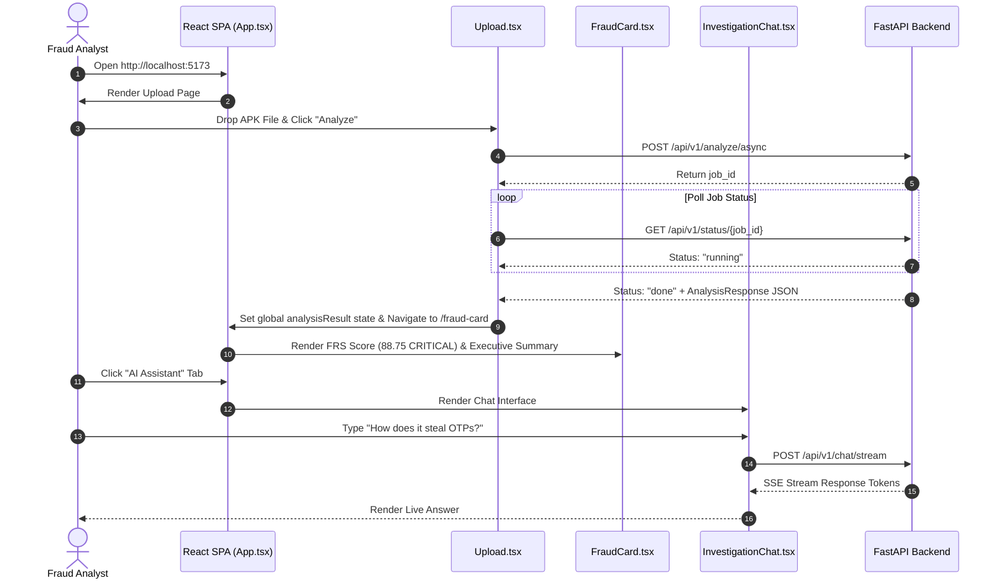

# 10 — Analyst Dashboard & Frontend Architecture

## Purpose

The **Analyst Dashboard** is the user-facing web interface for the Sudarshan platform. Built as a single-page application (SPA) using React 18, TypeScript, Vite 5, and Tailwind CSS, it presents raw technical malware analysis outputs as tailored, analyst-ready intelligence views for fraud investigators, SOC security engineers, and CISO executives.

---

## Responsibilities

The frontend dashboard is responsible for:
1. **File Ingestion & Job Tracking**: Providing drag-and-drop APK file upload interfaces (`Upload.tsx`) supporting synchronous processing and real-time asynchronous job polling.
2. **Executive Fraud Visualization**: Rendering the **Fraud Card** view (`FraudCard.tsx`) featuring prominent FRS risk badges, 5-axis STEI breakdowns, plain-English narratives, and customer advisory drafts.
3. **Technical SOC Reverse Engineering View**: Displaying the **Technical View** (`TechnicalView.tsx`) with decompiled manifest excerpts, dangerous permission lists, code findings, and component trees.
4. **Threat Intelligence Correlation View**: Rendering the **Threat Intel View** (`ThreatIntelView.tsx`) displaying VirusTotal vendor ratios, OTX pulse indicators, AbuseIPDB confidence scores, and malware family badges.
5. **Interactive AI Assistant Chat**: Providing a real-time Server-Sent Events (SSE) streaming chat interface (`InvestigationChat.tsx`) grounded in the case's RAG evidence graph.
6. **Case History & Session Management**: Tracking historical analysis cases (`History.tsx`) and managing JWT bearer authentication (`Login.tsx`).

---

## High-Level Overview

The dashboard categorizes complex malware findings into distinct operational perspectives:

```text
+-----------------------------------------------------------------------------------+
|                            SUDARSHAN ANALYST DASHBOARD                            |
|                                                                                   |
|  [ Upload APK ] ──► [ Async Status Polling ] ──► [ Analysis Complete ]            |
|                                                          │                        |
|    ┌──────────────────────┬──────────────────────────────┼─────────────────────┐  |
|    │                      │                              │                     │  |
|    ▼                      ▼                              ▼                     ▼  |
| +──────────────+   +────────────────+           +────────────────+  +────────────+ |
| | Fraud Card   |   | Technical View |           | Threat Intel   |  | AI Chat    | |
| | Executive    |   | SOC / Reverse  |           | Correlation    |  | Stream     | |
| | View         |   | View           |           | View           |  | Assistant  | |
| +──────────────+   +────────────────+           +────────────────+  +────────────+ |
+-----------------------------------------------------------------------------------+
```

---

## Architecture

The frontend application follows a modular, state-driven React 18 component hierarchy:

```mermaid
graph TD
    subgraph Core Shell & Router (App.tsx)
        NAV[Navigation Bar & Auth Guard]
        ROUTER[React Router v6 Routes]
    end

    subgraph Authentication
        LOGIN[Login Page / Login.tsx]
    end

    subgraph Views & Pages
        UP[Upload Page / Upload.tsx]
        FC[Fraud Card Page / FraudCard.tsx]
        TECH[Technical View / TechnicalView.tsx]
        INTEL[Threat Intel View / ThreatIntelView.tsx]
        CHAT[AI Assistant Stream / InvestigationChat.tsx]
        HIST[Case History / History.tsx]
    end

    subgraph Data Formatting & Utilities
        DERIVE[Derived UI State Helper / derive.ts]
    end

    NAV --> ROUTER
    ROUTER --> LOGIN
    ROUTER --> UP
    ROUTER --> FC
    ROUTER --> TECH
    ROUTER --> INTEL
    ROUTER --> CHAT
    ROUTER --> HIST

    FC --> DERIVE
    TECH --> DERIVE
    INTEL --> DERIVE
```

---

## Components

Primary React components in `frontend/src/`:

| Component / File | Location | Operational Role & Responsibilities |
| :--- | :--- | :--- |
| `App.tsx` | `frontend/src/App.tsx` | Root component managing navigation bar, authentication state, analysis result state, and route definitions. |
| `Upload.tsx` | `frontend/src/pages/Upload.tsx` | APK file dropzone, synchronous/asynchronous upload dispatcher, real-time polling progress bar. |
| `FraudCard.tsx` | `frontend/src/pages/FraudCard.tsx` | Executive view displaying FRS score badge, 5-axis STEI radar breakdown, plain-English narrative, and advisories. |
| `TechnicalView.tsx` | `frontend/src/pages/TechnicalView.tsx` | SOC technical view displaying manifest findings, dangerous permissions, components, certificate details, and code findings. |
| `ThreatIntelView.tsx` | `frontend/src/pages/ThreatIntelView.tsx` | Threat intelligence view displaying VirusTotal ratios, OTX pulses, AbuseIPDB scores, and malware family metadata. |
| `InvestigationChat.tsx` | `frontend/src/pages/InvestigationChat.tsx` | Real-time SSE streaming chat window enabling interactive analyst Q&A with the RAG engine. |
| `History.tsx` | `frontend/src/pages/History.tsx` | Historical case table fetching previously analyzed cases from `/api/v1/cases`. |
| `Login.tsx` | `frontend/src/pages/Login.tsx` | User login form issuing JWT tokens and saving credentials in `localStorage`. |
| `derive.ts` | `frontend/src/utils/derive.ts` | Utility module formatting raw analysis JSON into UI badges, risk colors, and formatted numbers. |

---

## Workflow

Analyst interaction workflow across dashboard views:



---

## Data Flow

Data transformation within the React state context:

$$\text{FastAPI AnalysisResponse JSON Output}$$
$$\Downarrow$$
$$\text{React Parent State Injection } (\texttt{setAnalysisResult} \text{ in } \texttt{App.tsx})$$
$$\Downarrow$$
$$\text{Utility Transformation } (\texttt{derive.ts} \rightarrow \text{Risk Badge Colors}, \text{Formatted Percentages})$$
$$\Downarrow$$
$$\text{Sub-Component Props Rendering } (\text{FraudCard}, \text{TechnicalView}, \text{ThreatIntelView})$$

---

## Algorithms

The dashboard uses formatting and color-derivation algorithms in `frontend/src/utils/derive.ts`:

### 1. FRS Risk Color Derivation
Maps Fraud Risk Scores ($0.0 - 100.0$) to Tailwind CSS styling classes:
```typescript
export function getRiskColorClass(score: number): string {
  if (score >= 85) return "bg-red-600 text-white border-red-800";
  if (score >= 60) return "bg-orange-500 text-white border-orange-700";
  if (score >= 30) return "bg-yellow-500 text-black border-yellow-600";
  return "bg-green-600 text-white border-green-800";
}
```

---

## Integration

The React dashboard connects to the FastAPI Gateway:

```text
+--------------------------------------------------------------------------+
|                           ANALYST DASHBOARD                              |
|                                                                          |
|  +--------------------+      +--------------------+      +-------------+ |
|  | React SPA          |=====>| VITE_API_URL       |=====>| FastAPI Gateway|
|  | (Port 5173)        |      | Axios / fetch      |      | (Port 8000) | |
|  +--------------------+      +--------------------+      +-------------+ |
+--------------------------------------------------------------------------+
```

---

## Folder Structure

Frontend source files in `frontend/src/`:

```text
frontend/src/
├── pages/
│   ├── Upload.tsx             <- APK File Dropzone & Polling Interface
│   ├── FraudCard.tsx          <- Executive View & 5-Axis STEI Breakdown
│   ├── TechnicalView.tsx      <- SOC Technical & Decompiled Manifest View
│   ├── ThreatIntelView.tsx    <- Threat Correlation (VT/OTX/AbuseIPDB) View
│   ├── InvestigationChat.tsx  <- SSE Real-Time Streaming Chat View
│   ├── History.tsx            <- Historical Cases Table
│   └── Login.tsx              <- JWT Authentication View
├── utils/
│   └── derive.ts              <- Risk Badge & Formatting Helpers
├── App.tsx                    <- Root Component & Navigation Bar
└── main.tsx                   <- React Entrypoint
```

---

## Configuration

Environment variables in `frontend/.env`:

| Variable | Default Value | Description |
| :--- | :--- | :--- |
| `VITE_API_URL` | `http://localhost:8000/api/v1` | FastAPI backend base API URL. |

---

## Error Handling

1. **Unauthenticated Access**: If a user attempts to access protected routes (`/fraud-card`, `/technical`) without a valid JWT token in `localStorage`, `RequireAuth` redirects to `/login`.
2. **Network Disconnection**: If backend API calls fail during job status polling, `Upload.tsx` displays an inline error alert banner with retry options.

---

## Current Implementation Status

| Dashboard View | Status | Operational Details |
| :--- | :--- | :--- |
| **Upload & Job Tracker** | **Implemented** | Async file dropzone and polling progress bar active. |
| **Fraud Card Executive View**| **Implemented** | FRS score badge, STEI breakdown, and advisory drafts active. |
| **Technical SOC View** | **Implemented** | Component trees, code findings, and manifest excerpts active. |
| **Threat Intel View** | **Implemented** | Vendor ratios, OTX pulses, and AbuseIPDB scores active. |
| **Interactive AI Chat Stream**| **Implemented** | SSE streaming interface connected to `/api/v1/chat/stream`. |
| **Case History Table** | **Implemented** | Persistent case listing connected to SQLite backend. |

---

## Current Limitations

1. **Local Storage Auth**: JWT bearer tokens are stored in browser `localStorage`; production deployments should transition to `HttpOnly` secure cookies.
2. **Static Chart Visuals**: STEI axis breakdowns use custom HTML/Tailwind progress bars rather than interactive canvas charting libraries (e.g., Recharts / Chart.js).

---

## Future Improvements

1. **Recharts Integration**: Replace HTML progress bars with interactive 5-axis SVG radar charts.
2. **PDF Direct Export Button**: Add a single-click "Download PDF" button triggering browser `window.print()` with `@media print` CSS rules.
