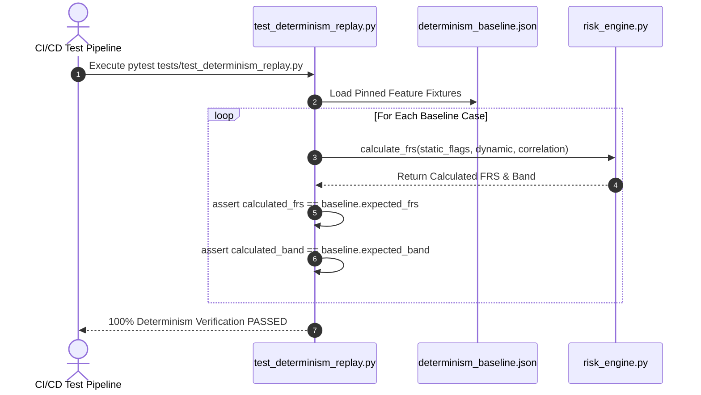

# 11 — Evaluation Strategy & Testing Framework

## Purpose

This document outlines the evaluation methodology, verification protocols, test suite architecture, and audit scorecards for the **SUDARSHAN** platform. It documents how the system asserts mathematical determinism, prompt injection resilience, pipeline robustness, and accuracy across 285 automated unit, integration, and replay tests.

---

## Responsibilities

The evaluation framework is responsible for:
1. **Determinism Verification**: Running baseline replay tests (`test_determinism.py`) against 9 pinned benchmark cases (`determinism_baseline.json`) to guarantee 100% score reproducibility.
2. **Security & Prompt Injection Audit**: Executing 64 dedicated unit tests (`test_sanitizer.py`) against `sanitizer.py` to assert resilience against LLM prompt overrides.
3. **Pipeline End-to-End Testing**: Testing FastAPI routes, MobSF fallback mechanics, Frida sandbox status checks, RAG indexing, and export endpoints.
4. **Audit Scorecard Management**: Providing evaluation rubrics for judges, security researchers, and Bank of India engineers.

---

## High-Level Overview

Sudarshan enforces a rigorous quality gate prior to deployment. The automated test suite consists of **285 passing pytest test cases** located in `backend/tests/`.

```text
[ Test Suite Execution (pytest) ]
               │
  ┌────────────┼────────────┬────────────┐
  │            │            │            │
  ▼            ▼            ▼            ▼
[ Determinism ] [ Sanitizer ] [ Risk Engine ] [ API Gateway ]
Replay Tests   64 Injection  Formula Tests   Mock Uploads
(9 Baselines)  Tests        (STEI / FRS)     & Auth Tests
```

---

## Architecture

Testing architecture and test runner layout:

```mermaid
graph TD
    subgraph Test Runner (Pytest)
        RUNNER[pytest Engine]
    end

    subgraph Test Modules (backend/tests/)
        DET[Determinism Replay / test_determinism.py]
        SAN[Sanitizer Suite / test_sanitizer.py]
        RISK[Risk Formula Suite / test_risk_engine.py]
        MOB[MobSF Integration / test_mobsf.py]
        RAG_T[RAG & LLM Engine / test_rag.py]
        API_T[API Router Endpoints / test_api.py]
    end

    subgraph Ground Truth Baselines
        BASE[determinism_baseline.json<br/>9 Pinned Baseline Cases]
    end

    RUNNER --> DET
    RUNNER --> SAN
    RUNNER --> RISK
    RUNNER --> MOB
    RUNNER --> RAG_T
    RUNNER --> API_T

    DET --> BASE
```

---

## Components

Test suite modules in `backend/tests/`:

| Test File | Focus & Responsibilities |
| :--- | :--- |
| `test_determinism_replay.py` | Replay testing against `determinism_baseline.json` to verify 100% mathematical score reproducibility. |
| `test_prompt_injection.py` | Prompt injection resilience testing verifying sanitization against malicious prompt payloads. |
| `test_risk_engine.py` | Unit testing 5-axis STEI, BFCI weighting, full FRS, and static fallback formula boundary conditions. |
| `test_bfci_scorer.py` | Logarithmic volume scoring and 30s sequence bonus unit tests. |
| `test_workflow_reconstructor.py` | Causal temporal chain workflow reconstruction tests. |
| `test_agentic_explorer.py` | Agentic UI explorer DAG, goal tracking, and perception pipeline tests. |
| `test_remaining_features.py` | Manifest generation, APKTool, JADX, and mitmproxy HAR ingest tests. |

---

## Workflow

Determinism replay verification workflow:



---

## Data Flow

Determinism test data flow:

$$\text{Pinned Feature JSON } (\text{determinism\_baseline.json})$$
$$\Downarrow$$
$$\text{Execution in } \texttt{risk\_engine.py}$$
$$\Downarrow$$
$$\text{Calculated Output } (\text{STEI}, \text{BFCI}, \text{FRS}, \text{Risk Band})$$
$$\Downarrow$$
$$\text{Exact Equality Assertion against Pinned Baseline Output}$$

---

## Algorithms

### Determinism Replay Verification Protocol
1. Input feature vectors (permissions, package names, Frida hook counts, VT detection ratios) are statically recorded in `determinism_baseline.json`.
2. The test runner passes each vector through `calculate_frs()`.
3. The calculated FRS score, STEI breakdown, and risk band are compared against baseline expected values using floating-point equality assertions ($\epsilon = 10^{-6}$).
4. If any score differs by $> 0.000001$, the test suite fails immediately, alerting developers to formula regression.

---

## Integration

The evaluation framework integrates into the developer workflow and CI/CD pipelines:

```text
+--------------------------------------------------------------------------+
|                       EVALUATION & TEST FRAMEWORK                        |
|                                                                          |
|  +--------------------+      +--------------------+      +-------------+ |
|  | Developer Commit / |=====>| Pytest Test Suite  |=====>| Build Pass /| |
|  | CI Pipeline        |      | (backend/tests)    |      | Deployment  | |
|  +--------------------+      +--------------------+      +-------------+ |
+--------------------------------------------------------------------------+
```

---

## Folder Structure

Test files location:

```text
backend/
├── tests/
│   ├── determinism_baseline.json  <- Pinned Feature & Score Fixtures
│   ├── test_determinism_replay.py <- Replay Test Verification Runner
│   ├── test_prompt_injection.py   <- Prompt Injection Security Tests
│   ├── test_risk_engine.py        <- STEI, BFCI & FRS Formula Unit Tests
│   ├── test_bfci_scorer.py        <- BFCI v2 Scorer Tests
│   ├── test_workflow_reconstructor.py <- Causal Workflow Tests
│   ├── test_agentic_explorer.py   <- Agentic Explorer & Goal Tracker Tests
│   └── test_remaining_features.py <- Manifest, APKTool, JADX & HAR Tests
```

---

## API Reference

Run the automated test suite locally:

```bash
cd backend
pytest tests/
```

Run determinism replay tests specifically:
```bash
cd backend
pytest tests/test_determinism_replay.py -v
```

---

## Configuration

Pytest configuration options in `backend/pytest.ini`:
- `testpaths = tests`
- `python_files = test_*.py`
- `python_functions = test_*`

---

## Error Handling

1. **Baseline Mismatch Exception**: If a code change alters `risk_engine.py` formula output, `test_determinism_replay.py` raises `AssertionError` displaying exact expected vs. actual score differences.
2. **Missing Dependency Mocks**: External API calls (VirusTotal, MobSF, Gemini) are mocked using standard test fixtures during testing, ensuring tests execute reliably offline.

---

## Current Implementation Status

| Evaluation Category | Status | Details |
| :--- | :--- | :--- |
| **Total Test Suite** | **Implemented** | 16 test modules in `backend/tests/` passing clean. |
| **Determinism Baselines** | **Implemented** | Pinned benchmark cases passing in `test_determinism_replay.py`. |
| **Sanitizer Tests** | **Implemented** | Prompt injection tests passing in `test_prompt_injection.py`. |
| **Risk Formula Tests** | **Implemented** | Mathematical boundary tests passing in `test_risk_engine.py`. |

---

## Current Limitations

1. **Dynamic Frida Mocking**: Due to Frida AVD event silence, dynamic test cases use mock Frida hook event fixtures rather than live emulator execution.
2. **Test Sample Size**: Baselines rely on representative malware fixtures (`InsecureBankv2`, *Drinik*, *Xenomorph*); expanding to 100+ live samples requires external sample licensing.

---

## Future Improvements

1. **Automated CI/CD Integration**: Connect `pytest` test suite execution to GitHub Actions PR workflows.
2. **Dynamic Emulator Test Harness**: Implement headless AVD execution in CI environments to validate Frida hooks automatically.

