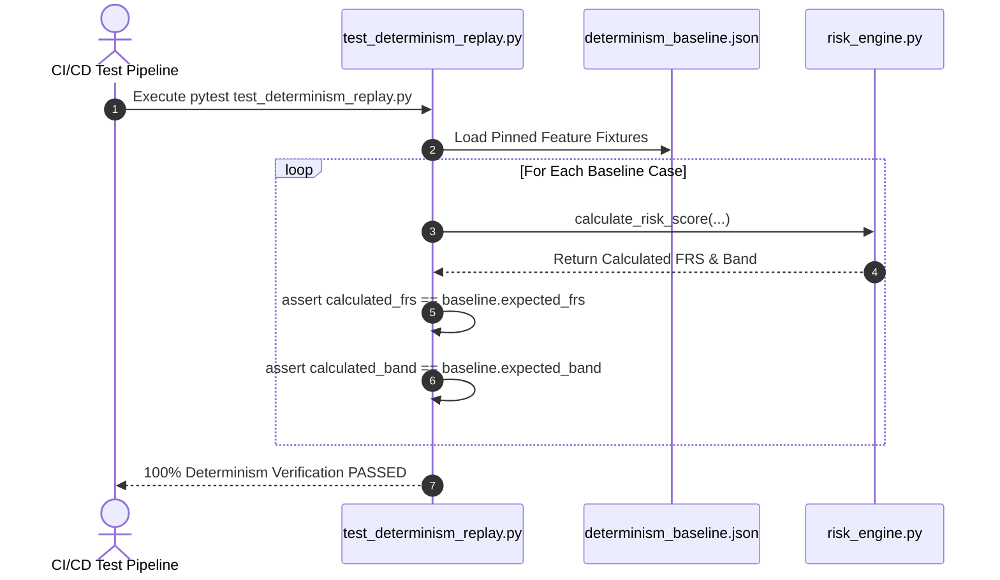

# 11 - Evaluation Strategy & Testing Framework

## Purpose

This document outlines the evaluation methodology, verification protocols, test suite architecture, and audit scorecards for the **SUDARSHAN** platform. It documents how the system asserts mathematical determinism, prompt injection resilience, pipeline robustness, and accuracy across **920 automated unit, integration, and replay tests** (measured 2026-08-16; 525 of them enforced by CI).

---

## Responsibilities

The evaluation framework is responsible for:
1. **Determinism Verification**: Running baseline replay tests ([`test_determinism_replay.py`](../../backend/tests/test_determinism_replay.py)) against pinned benchmark cases ([`determinism_baseline.json`](../../backend/tests/determinism_baseline.json)) to guarantee 100% score reproducibility.
2. **Security & Prompt Injection Audit**: Executing dedicated unit tests ([`test_prompt_injection.py`](../../backend/tests/test_prompt_injection.py)) against [`sanitizer.py`](../../shared/sudarshan_core/engines/agentic/sanitizer.py) to assert resilience against LLM prompt overrides.
3. **Pipeline End-to-End Testing**: Testing FastAPI routes, MobSF fallback mechanics, Frida sandbox status checks, RAG indexing, and export endpoints.
4. **Audit Scorecard Management**: Providing evaluation rubrics for judges, security researchers, and Bank of India engineers.

---

## High-Level Overview

Sudarshan enforces a rigorous quality gate prior to deployment. The automated test suite consists of **920 collected pytest test cases** (measured 2026-08-16; only 525 are enforced by CI) located in [`tests/`](../../tests/) and [`backend/tests/`](../../backend/tests/).

```text
[ Test Suite Execution (pytest) ]
               │
  ┌────────────┼────────────┬────────────┬────────────┐
  │            │            │            │            │
  ▼            ▼            ▼            ▼            ▼
[ Determinism ] [ Sanitizer ] [ Risk Engine ] [ Sandbox ] [ API Gateway ]
Replay Tests   Prompt Injection Formula Tests Provider    Mock Uploads
(9 Baselines)  Tests (64)   (STEI / FRS)     tests       & Auth Tests
```

---

## Architecture

Testing architecture and test runner layout:

```mermaid
graph TD
    subgraph Test Runner (Pytest)
        RUNNER[pytest Engine]
    end

    subgraph Test Modules (tests/ & backend/tests/)
        DET[Determinism Replay / test_determinism_replay.py]
        SAN[Sanitizer Suite / test_prompt_injection.py]
        RISK[Risk Formula Suite / test_risk_engine.py]
        BFCI_T[BFCI Scorer / test_bfci_scorer.py]
        WORK_T[Workflow Reconstructor / test_workflow_reconstructor.py]
        AGENT_T[Agentic Explorer / test_agentic_explorer.py]
        REM[Remaining Features / test_remaining_features.py]
        MAN_REP[Manifest Repair / test_manifest_repair.py]
    end

    subgraph Ground Truth Baselines
        BASE[determinism_baseline.json<br/>Pinned Baseline Cases]
    end

    RUNNER --> DET
    RUNNER --> SAN
    RUNNER --> RISK
    RUNNER --> BFCI_T
    RUNNER --> WORK_T
    RUNNER --> AGENT_T
    RUNNER --> REM
    RUNNER --> MAN_REP

    DET --> BASE
```

---

## Components

Test suite modules in [`backend/tests/`](../../backend/tests/):

| Test File | Focus & Responsibilities |
| :--- | :--- |
| [`test_determinism_replay.py`](../../backend/tests/test_determinism_replay.py) | Replay testing against `determinism_baseline.json` to verify 100% mathematical score reproducibility. |
| [`test_prompt_injection.py`](../../backend/tests/test_prompt_injection.py) | Prompt injection resilience testing verifying sanitization against malicious prompt payloads. |
| [`test_risk_engine.py`](../../backend/tests/test_risk_engine.py) | Unit testing 5-axis STEI, BFCI weighting, full FRS, and static fallback formula boundary conditions. |
| [`test_bfci_scorer.py`](../../backend/tests/test_bfci_scorer.py) | Logarithmic volume scoring and 30s sequence bonus unit tests. |
| [`test_workflow_reconstructor.py`](../../backend/tests/test_workflow_reconstructor.py) | Causal temporal chain workflow reconstruction tests. |
| [`test_agentic_explorer.py`](../../backend/tests/test_agentic_explorer.py) | Agentic UI explorer DAG, goal tracking, and perception pipeline tests. |
| [`test_remaining_features.py`](../../backend/tests/test_remaining_features.py) | Manifest generation, APKTool, JADX, and mitmproxy HAR ingest tests. |
| [`test_detection_regressions.py`](../../backend/tests/test_detection_regressions.py) | Detection regression assertions across malware patterns. |
| [`test_frida_preflight.py`](../../backend/tests/test_frida_preflight.py) | Frida attach SELinux preflight execution verification. |

---

## Workflow

Determinism replay verification workflow:



---

## Algorithms

### Determinism Replay Verification Protocol
1. Input feature vectors (permissions, package names, Frida hook counts, VT detection ratios) are statically recorded in `determinism_baseline.json`.
2. The test runner passes each vector through `calculate_risk_score()`.
3. The calculated FRS score, STEI breakdown, and risk band are compared against baseline expected values using floating-point equality assertions ($\epsilon = 10^{-6}$).
4. If any score differs by $> 0.000001$, the test suite fails immediately, alerting developers to formula regression.

---

## Integration

The evaluation framework integrates into developer workflow and CI/CD pipelines:

```text
+--------------------------------------------------------------------------+
|                       EVALUATION & TEST FRAMEWORK                        |
|                                                                          |
|  +--------------------+      +--------------------+      +-------------+ |
|  | Developer Commit / |=====>| Pytest Test Suite  |=====>| Build Pass /| |
|  | CI Pipeline        |      | (tests/ +          |      | Deployment  | |
|  |                    |      |  backend/tests)    |      |             | |
|  +--------------------+      +--------------------+      +-------------+ |
+--------------------------------------------------------------------------+
```

---

## Folder Structure

Test files location:

```text
tests/
├── unit/
│   ├── test_sandbox_provider.py       # SandboxProvider factory & ADB checks
│   ├── test_frida_pipeline_full.py    # Full dynamic pipeline integration
│   ├── test_evidence_pipeline.py      # EvidenceStore / EventBus
│   └── test_tier2_agentic.py          # Agentic explorer tier-2 paths
├── integration/
│   └── test_pipeline.py               # End-to-end pipeline (optional live deps)
└── apks/                              # Corpus manifest + validation_runs artifacts

backend/
├── tests/
│   ├── determinism_baseline.json      # Pinned feature & score fixtures
│   ├── test_determinism_replay.py     # Replay verification runner
│   ├── test_prompt_injection.py       # Prompt injection security tests
│   ├── test_risk_engine.py            # STEI, BFCI & FRS formula unit tests
│   ├── test_bfci_scorer.py            # BFCI v2 scorer tests
│   ├── test_workflow_reconstructor.py # Causal workflow tests
│   ├── test_agentic_explorer.py       # Agentic explorer & goal tracker tests
│   ├── test_detection_regressions.py  # Detection regression tests
│   ├── test_frida_preflight.py        # Frida SELinux preflight tests
│   ├── test_validation_corpus.py      # Corpus manifest & validation helpers
│   ├── test_screenshot_report_pipeline.py # Screenshot manifest in HTML reports
│   └── test_remaining_features.py     # Manifest, APKTool, JADX & HAR tests
```

Live sandbox corpus runs (not part of default `pytest` collection): see [`VALIDATION.md`](../VALIDATION.md) and [`validate_dynamic_pipeline.py`](../../validate_dynamic_pipeline.py).

---

## API Reference

Run the automated test suite locally (**920 tests collected**; CI runs only the 525 under `backend/tests/`):

```powershell
$env:PYTHONPATH="backend;shared"; $env:JWT_SECRET_KEY="test_secret_key_for_pytest"; backend\.venv\Scripts\python.exe -m pytest tests/ backend/tests
```

Run determinism replay tests specifically:
```powershell
$env:PYTHONPATH="backend;shared"; $env:JWT_SECRET_KEY="test_secret_key_for_pytest"; backend\.venv\Scripts\python.exe -m pytest backend/tests/test_determinism_replay.py -v
```

---

## Current Implementation Status

| Evaluation Category | Status | Details |
| :--- | :--- | :--- |
| **Total Test Suite** | **Implemented** | **920** pytest cases across `tests/` and `backend/tests/`. **525 are enforced by CI** - `ci.yml` runs pytest with `working-directory: backend`, so `tests/unit/` and `tests/integration/` (including every `test_vide_*.py`) are collected locally but never gated. One collection error: `test_pdf_generator.py` requires `pypdf`, which is not a declared dependency. |
| **Sandbox Containment Tests** | **Implemented** | `tests/unit/test_sandbox_containment.py`, `test_adb_policy_bypass.py`, `test_blocker_fixes.py`; `backend/tests/test_gateway_dynamic_blocker.py`. |
| **Determinism Baselines** | **Implemented** | Pinned benchmark cases passing in `test_determinism_replay.py`. |
| **Sanitizer Tests** | **Implemented** | Prompt injection tests passing in `test_prompt_injection.py`. |
| **Risk Formula Tests** | **Implemented** | Mathematical boundary tests passing in `test_risk_engine.py`. |
