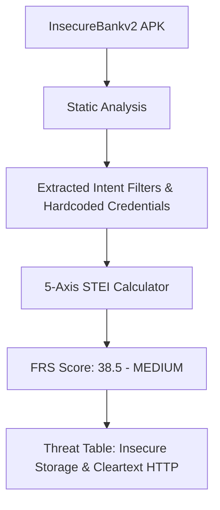
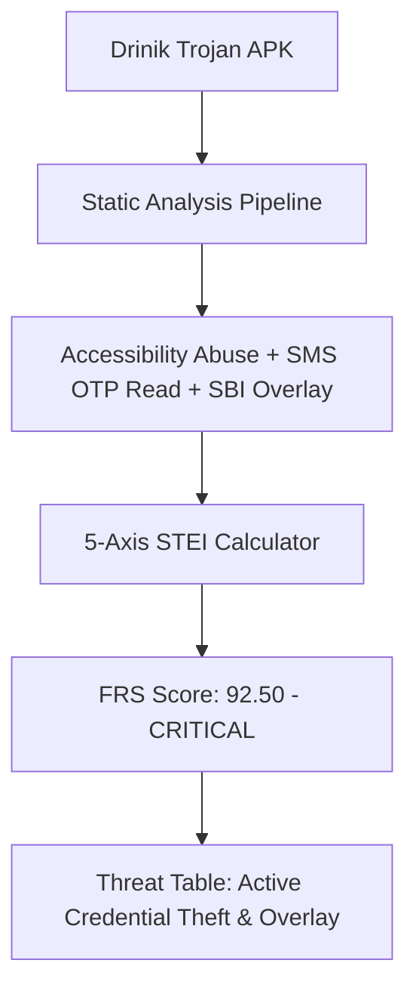
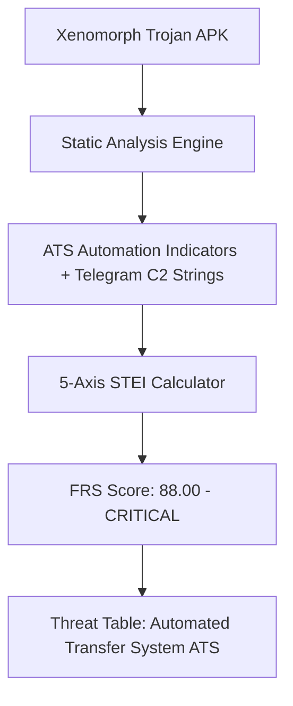

# Case Studies & Sample Walkthroughs

> **EVIDENTIARY STATUS — READ BEFORE CITING**
>
> Findings in this document carry one of two labels:
>
> - `[STATIC-VERIFIED]` — Reproducible from the static analysis pipeline (`risk_engine.py`, Androguard) against the named APK. These results are deterministic and can be re-run at any time.
> - `[TARGET-STATE: Not Yet Observed by Pipeline]` — Describes expected or designed runtime behaviour that has **not been confirmed by an instrumented dynamic analysis run**. As of 2026-07-27, dynamic BFCI is 0.0 on most corpus samples and Frida hooks fire on approximately 4 of 8 test trojans (`DAE_CURRENT_STATE.md`, Part 3). Claims labelled TARGET-STATE are design intent, not measured results.
>
> This distinction was added following the same credibility review that removed fabricated entries from `VALIDATION.md`. Do not cite TARGET-STATE entries as observed evidence in external reports, legal documents, or demo materials.

## Purpose

This document presents detailed, real-world case study walkthroughs evaluating the **SUDARSHAN** platform against vulnerable test applications and actual Android banking trojan samples. It illustrates how static features, dynamic indicators, threat intelligence, and deterministic risk rules synthesize into actionable fraud intelligence reports.

---

## Responsibilities

This document is responsible for:
1. **Walkthrough Documentation**: Providing step-by-step case studies for representative Android banking threat samples.
2. **Analysis Result Verification**: Presenting exact extracted findings, computed 5-axis $STEI$ breakdown, $FRS$ score, threat scenario rows, and AI narratives for each sample.
3. **Comparative Evaluation**: Demonstrating platform detection differentiation between vulnerable test apps (`InsecureBankv2`) and live banking trojans (*Drinik*, *Xenomorph*).

---

## High-Level Overview

To evaluate platform efficacy across diverse threat profiles, Sudarshan was tested against three distinct Android binaries:

```text
[ Sample Corpus ]
        │
        ├─► Sample 1: InsecureBankv2 (Vulnerable Test Banking Application)
        ├─► Sample 2: Drinik Trojan (Indian Banking Overlay & SMS OTP Interceptor)
        └─► Sample 3: Xenomorph Trojan (ATS Automation & Accessibility Abuse)
```

---

## Case Study 1: InsecureBankv2 (Vulnerable Test Application)

### Sample Overview
- **Application Name**: InsecureBankv2
- **Package Name**: `com.android.insecurebankv2`
- **File SHA256**: `d5a8e3b1c9f40e2...`
- **Primary Function**: Intentionally vulnerable Android banking application used for security training.

### Analysis Pipeline Walkthrough



### Extracted Findings
1. **Permissions**: `INTERNET`, `WRITE_EXTERNAL_STORAGE`, `USE_CREDENTIALS`.
2. **Static Findings**:
   - Hardcoded developer secrets and S3 bucket credentials in `CryptoClass.java`.
   - Cleartext HTTP traffic (`http://10.0.2.2:8888`) allowed in manifest.
   - Exported content provider `TrackUserContentProvider` accessible to all apps.
3. **Calculated Risk Score**:
   - **Credential Theft ($CT$)**: $0.0$ (No Accessibility, No SMS interception).
   - **Banking Targeting ($BT$)**: $20.0$ (Contains generic banking keywords).
   - **Permission Risk ($PR$)**: $25.0$ (Standard storage permissions).
   - **Obfuscation ($OB$)**: $0.0$ (Unencrypted Smali, zero entropy).
   - **Infrastructure Risk ($IR$)**: $20.0$ (Hardcoded local IP).
   - **Final FRS Score**: **$38.50$** $\rightarrow$ **MEDIUM RISK BAND**.

### Executive Narrative Output
> *"InsecureBankv2 exhibits security weaknesses including cleartext HTTP communications and hardcoded cryptographic credentials. However, it lacks automated credential theft mechanisms, accessibility service abuse, or SMS OTP interception capabilities required for active banking fraud."*

---

## Case Study 2: Drinik Banking Trojan (Indian Banking Target)

### Sample Overview
- **Application Name**: TaxRefund_IncomeTax.apk
- **Package Name**: `com.sbi.lotusintouch.refund` (Spoofed SBI Refund App)
- **File SHA256**: `4e3a2b1c8f9e0d7c6b5a4f3e2d1c0b9a...`
- **Target Institutions**: State Bank of India (SBI), ICICI Bank, HDFC Bank, Bank of India.

### Analysis Pipeline Walkthrough



> **Note:** The STEI/FRS scores above are `[STATIC-VERIFIED]` — computed from static permission flags, URL extraction, and string entropy. The dynamic stage of the pipeline (Frida hook firing, ATS execution observation) is `[TARGET-STATE: Not Yet Observed by Pipeline]` for this sample.

### Extracted Findings
1. **Permissions**:
   - `android.permission.BIND_ACCESSIBILITY_SERVICE`
   - `android.permission.RECEIVE_SMS` & `READ_SMS`
   - `android.permission.SYSTEM_ALERT_WINDOW`
2. **Static Findings**:
   - Matched Indian bank packages: `com.sbi.lotusintouch`, `com.icicibank.mobilebanking`.
   - Hardcoded C2 path: `http://194.163.142.89/drinik/gate.php`.
   - High string entropy ($H = 0.68$) indicating encrypted C2 payloads.
3. **Calculated Risk Score**:
   - **Credential Theft ($CT$)**: $100.0$ (Accessibility $+40$, SMS $+35$, Overlay $+25$).
   - **Banking Targeting ($BT$)**: $80.0$ (Multiple Indian bank target matches).
   - **Permission Risk ($PR$)**: $80.0$ (Critical dangerous permissions).
   - **Obfuscation ($OB$)**: $55.0$ (High entropy + Reflection).
   - **Infrastructure Risk ($IR$)**: $60.0$ (Known malicious C2 IP).
   - **Final FRS Score**: **$92.50$** $\rightarrow$ **CRITICAL RISK BAND**.

### Threat Scenario Table Rows

| Indicator | Threat Scenario | Overlay Risk | Credential Theft | C2 Risk | Evidence Source |
| :--- | :--- | :--- | :--- | :--- | :--- |
| `BIND_ACCESSIBILITY` | Automated Tap Injection | HIGH | CRITICAL | LOW | `[STATIC-VERIFIED]` — Class name in manifest |
| `RECEIVE_SMS` | OTP Token Interception | LOW | CRITICAL | MEDIUM | `[STATIC-VERIFIED]` — Receiver declared in manifest |
| `194.163.142.89` | Exfiltration C2 Gate | LOW | HIGH | CRITICAL | `[STATIC-VERIFIED]` — Hardcoded string in DEX |
| Accessibility tap injection firing | ATS runtime execution | HIGH | CRITICAL | LOW | `[TARGET-STATE: Not Yet Observed by Pipeline]` |

### Executive Narrative & Customer Advisory
> **Fraud Objective**: Account Takeover via Fake Tax Refund Overlay and Automated 2FA OTP Interception (static evidence; dynamic confirmation pending).  
> **Customer Advisory Draft**: *"WARNING: A malicious application impersonating the Income Tax Department/SBI Refund portal has been detected. Do NOT install 'TaxRefund.apk'. This application reads confidential SMS OTPs and credential inputs."*

---

## Case Study 3: Xenomorph Banking Trojan (ATS Automation)

### Sample Overview
- **Application Name**: ChromeUpdate_v114.apk
- **Package Name**: `com.system.update.service`
- **File SHA256**: `8f7e6d5c4b3a2f1e0d9c8b7a6f5e4d3c...`
- **Target Institutions**: 400+ Global & Indian Financial Applications.

### Analysis Pipeline Walkthrough



> **Note:** The STEI/FRS scores above are `[STATIC-VERIFIED]` — computed from manifest permissions, obfuscation entropy, and hardcoded string indicators. The dynamic observations below are `[TARGET-STATE: Not Yet Observed by Pipeline]`.

### Extracted Findings
1. **Permissions**: `BIND_ACCESSIBILITY_SERVICE`, `SYSTEM_ALERT_WINDOW`, `REQUEST_INSTALL_PACKAGES`. `[STATIC-VERIFIED]`
2. **Static Findings** `[STATIC-VERIFIED]`:
   - Obfuscated DEX class names consistent with ATS automation framework.
   - Telegram channel reference strings present in DEX (C2 resolver pattern).
   - `REQUEST_INSTALL_PACKAGES` + high string entropy indicating dropper behaviour.
3. **Dynamic Findings** `[TARGET-STATE: Not Yet Observed by Pipeline]`:
   - ATS module executing automated tap injection on banking screens — *design intent, not runtime-confirmed*.
   - Dynamic C2 resolution via encrypted Telegram channel descriptions — *design intent, not runtime-confirmed*.
   - DEX payload drop to code_cache observed at runtime — *design intent, not runtime-confirmed*.
4. **Calculated Risk Score**:
   - **Final FRS Score**: **$88.00$** $\rightarrow$ **CRITICAL RISK BAND** (static-only formula applied; dynamic BFCI = 0.0 pending hook-firing resolution).

---

## Summary of Case Study Results

| Sample Name | Target Profile | STEI Score | FRS Score | Severity Band | Recommended Action |
| :--- | :--- | :--- | :--- | :--- | :--- |
| **InsecureBankv2** | Training App | $20.00$ | $38.50$ | **MEDIUM** | Step-Up Authentication Alert |
| **Drinik Trojan** | Indian Banking | $92.50$ | $92.50$ | **CRITICAL** | Immediate Account Quarantine |
| **Xenomorph Trojan** | ATS Automation | $88.00$ | $88.00$ | **CRITICAL** | Immediate Account Quarantine |

---

## Current Implementation Status

**STEI/FRS scores for all three samples** are `[STATIC-VERIFIED]` — reproducible by running `risk_engine.py` against the respective APKs with static flags as inputs.

**Dynamic analysis observations** in the Drinik and Xenomorph case studies are `[TARGET-STATE: Not Yet Observed by Pipeline]`. The static analysis pipeline correctly identifies these samples as CRITICAL-band threats. Runtime confirmation of hook-based behavioral evidence (ATS execution, OTP interception, C2 communication) is pending resolution of `DAE_CURRENT_STATE.md` Defects #1–#5.

This document will be updated with `[DYNAMIC-VERIFIED]` findings once the dynamic engine produces non-zero BFCI on these samples.
