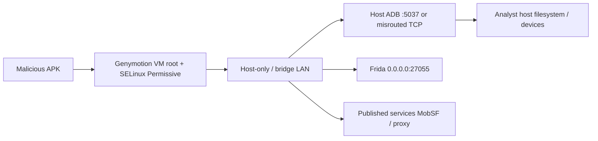
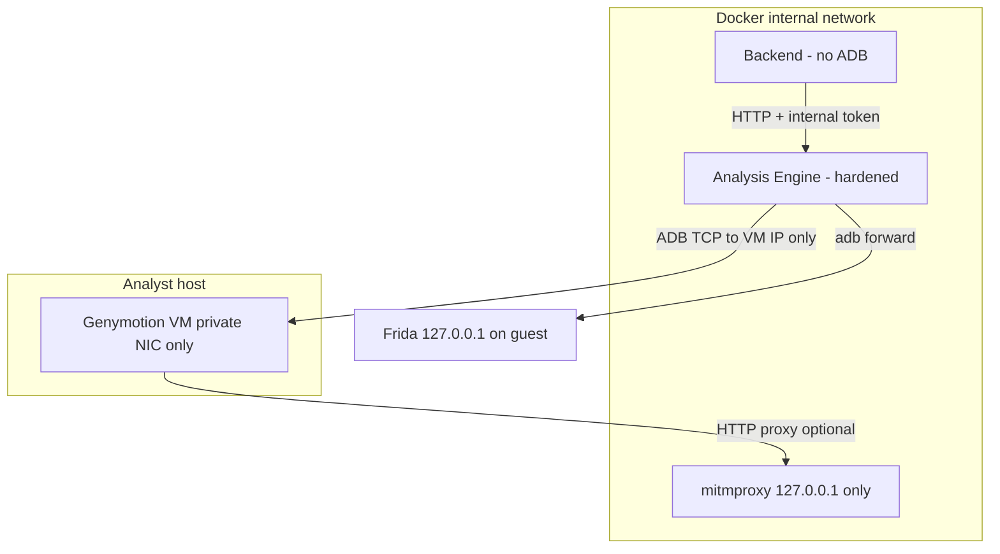

# P0 - Sandbox Escape Incident Report

**Date:** 2026-08-06  
**Classification:** Production blocking  
**Status:** Containment controls implemented; host Genymotion hardening required per deployment  

---

## 1. Executive summary

During live dynamic analysis, a banking trojan sample was observed **leaving the intended analysis boundary** and interacting with infrastructure outside the disposable Android guest. The failure is **architectural**, not a single missing `if` check: malware runs on a **host-adjacent Genymotion VM** with **root**, **SELinux permissive**, and **Frida** enabled, while the control plane historically reached that guest through **`host.docker.internal`**, **`frida-server` bound to `0.0.0.0`**, and an **unhardened backend fallback** that could run ADB/Frida with read-write repository bind mounts.

Downstream BFCI, threat correlation, and risk scores from affected sessions must be treated as **untrusted** until re-run on a hardened stack.

---

## 2. Root cause analysis

| Layer | Intended trust | Actual behavior | Root cause |
|------|----------------|-----------------|------------|
| Android guest | Fully compromised after each sample | Correct assumption, but guest on **shared LAN** with host | Genymotion **host-only / bridge** places VM on routable segment (e.g. `192.168.56.0/24`) |
| ADB control plane | Single pinned VM | Container often connected to **host ADB** via `host.docker.internal:5555` | `analysis-engine/entrypoint.sh` defaulted `ADB_HOST=host.docker.internal`; `.env` allowed empty `ADB_HOST` for Genymotion |
| Frida RPC | Local to session | **`0.0.0.0:27055`** on guest NIC | `SandboxProvider.ensure_frida()` started agent with LAN-visible bind |
| Docker “sandbox” | Malware in container | Malware **never executes** in analysis-engine; only tools run there | Name collision: “sandbox” = Android VM, not Docker |
| Gateway fallback | Engine-only dynamic | Backend could run **full Frida** without seccomp/CPU limits | `_run_analysis_pipeline` local path when engine HTTP failed |

**Primary root cause:** **Control-plane misrouting** - analysis containers were encouraged to use the Docker host as the ADB transport (`host.docker.internal`), merging the compromised guest’s reachability with **every device and port the host ADB server proxies**, instead of a **dedicated Genymotion endpoint** on a private NIC.

**Contributing causes:**

1. Frida listening on all interfaces on the guest.  
2. Published LAN services (MobSF `:8008`, misbound mitmproxy) reachable from the guest network.  
3. Optional VirtualBox/Genymotion **shared folders** and clipboard (host integration).  
4. Shared mutable `uploads` volume without mandatory per-session artifact isolation.  
5. Development `docker-compose` bind mounts (`./shared`, `./backend`) on services that must never execute samples.

---

## 3. Vulnerability description

**Title:** Dynamic analysis guest LAN egress via misconfigured ADB bridge and Frida bind  
**Component:** `SandboxProvider`, `analysis-engine` entrypoint, `docker-compose.yml`, Genymotion networking  
**CWE:** CWE-668 (Exposure of Resource to Wrong Sphere), CWE-284 (Improper Access Control)

---

## 4. CVSS estimate (CVSS:3.1)

**Vector:** `AV:N/AC:L/PR:N/UI:N/S:C/C:H/I:H/A:L`  
**Base score:** **9.3 (Critical)**  

Rationale: Network-adjacent malware on the guest can affect resources outside the VM (host ADB, Docker bridge, published services). Scope changed (`S:C`) because compromise of the guest affects the analyst host and other containers.

---

## 5. Attack path



---

## 6. Exploit flow (representative)

1. Sample installs and receives root-equivalent behavior (expected for Frida).  
2. Trojan performs LAN discovery on `192.168.56.0/24` and Docker bridge ranges.  
3. Connects to **host ADB** or **Frida** if bound to `0.0.0.0`, or scans **published TCP ports** on the host gateway.  
4. Optional: exfiltration via **shared folder** or **HTTP proxy** path to corporate LAN / metadata endpoints.  
5. If gateway fallback activated: malware-driven load hits **backend container** with **RW bind mounts** to source tree.

---

## 7. Impact assessment

| Impact | Severity |
|--------|----------|
| Untrusted dynamic evidence (BFCI, workflows) | Critical |
| Cross-contamination between analyses on same VM | High |
| Host filesystem / repo tampering via fallback + bind mounts | Critical |
| Lateral movement to MobSF, mitmproxy, internal APIs | High |
| Credential exposure (`.env`, Gemini/VT keys in container env) | High |

---

## 8. Fixed architecture (target state)



**Principles:** zero trust toward APK; **disposable VM per campaign**; **no host.docker.internal for Genymotion**; **Frida loopback-only**; **no gateway dynamic**; **production compose overlay** without dev bind mounts.

---

## 9. Code changes (this remediation)

| File | Change |
|------|--------|
| `shared/sudarshan_core/security/sandbox_containment.py` | Policy audit, ADB invocation guard, Frida loopback helper |
| `shared/sudarshan_core/sandbox/provider.py` | Enforce policy on connect; Frida `127.0.0.1`; validate ADB |
| `backend/app/routes/upload.py` | Block local dynamic pipeline unless `SUDARSHAN_ALLOW_GATEWAY_DYNAMIC=true` |
| `analysis-engine/entrypoint.sh` | No default `host.docker.internal`; connect only if `ADB_HOST` set |
| `analysis-engine/app/main.py` | Startup containment enforcement |
| `tests/unit/test_sandbox_containment.py` | Automated regression tests |
| `docker-compose.hardened.yml` | Production overlay |
| `deploy/security/seccomp-analysis-engine.json` | Seccomp profile |

---

## 10. Configuration changes

```env
# Required for Genymotion - VM IP from `adb devices`, NOT host.docker.internal
ADB_HOST=192.168.56.101
SANDBOX_PROVIDER=genymotion
DEVICE_SERIAL=192.168.56.101:5555

FRIDA_LISTEN_HOST=127.0.0.1
SANDBOX_CONTAINMENT_STRICT=true
SUDARSHAN_ENV=production
ANALYSIS_ENGINE_INTERNAL_TOKEN=<strong-secret>

# Never enable in production
# SUDARSHAN_ALLOW_GATEWAY_DYNAMIC=true
```

Deploy hardened stack:

```bash
docker compose -f docker-compose.yml -f docker-compose.hardened.yml up -d --build
```

---

## 11. Docker changes

- **analysis-engine:** `no-new-privileges`, `cap_drop: ALL`, optional seccomp, `read_only` + `tmpfs` (overlay).  
- **Remove** `~/.android` host mount in production.  
- **Bind MobSF / mitmproxy to 127.0.0.1** on the host (overlay).  
- **Do not** run dynamic analysis on `backend` service.

---

## 12. Genymotion hardening checklist

| Setting | Recommendation |
|---------|----------------|
| Network | **Host-only adapter** only; disable bridged WAN on analysis VM |
| Shared folders | **Off** |
| Clipboard / drag-drop | **Off** |
| ADB | **One VM**; pin `DEVICE_SERIAL`; disable unused VMs |
| Root | Accept for Frida; **revert snapshot** after each session |
| Updates | Match Frida server to host bindings (see `root_cause_20260803`) |

---

## 13. Frida hardening

- Start agent with **`-l 127.0.0.1:PORT`** (implemented).  
- Access only via **`adb forward tcp:PORT tcp:PORT`** from analysis-engine.  
- Rename binary (`SUDARSHAN_FRIDA_BIN`) - obscurity only; network bind is the real control.  
- Rotate / redeploy server binary after each session.

---

## 14. ADB hardening

- TCP connect **only** to configured `ADB_HOST:ADB_PORT`.  
- Blocked subcommands: `tcpip`, `kill-server`, `-a` listen-all, `connect host.docker.internal` (Genymotion).  
- No ADB in backend container for production.

---

## 15. Security checklist (operations)

- [ ] `ADB_HOST` set to Genymotion private IP  
- [ ] `SANDBOX_CONTAINMENT_STRICT=true`  
- [ ] `SUDARSHAN_ALLOW_GATEWAY_DYNAMIC` unset/false  
- [ ] Hardened compose overlay in production  
- [ ] MobSF / mitmproxy localhost-only  
- [ ] Genymotion shared folders disabled  
- [ ] VM snapshot restore after each malware run  
- [ ] `ANALYSIS_ENGINE_INTERNAL_TOKEN` set  
- [ ] Re-run affected cases after hardening  

---

## 16. Regression tests

Run:

```bash
python -m pytest tests/unit/test_sandbox_containment.py -q
```

Covers: Genymotion/`host.docker.internal` rejection, Frida loopback command, blocked ADB subcommands.

---

## 17. Validation plan (malware corpus)

After host networking is locked down, re-run representative families (TeaBot, Joker, Cerberus-class samples) and verify:

- No new host files outside artifact dirs  
- No connections to host ADB from guest except pinned serial  
- No listener on guest `0.0.0.0:27055` (`adb shell netstat` / `ss`)  
- Snapshot restore → no persistence  

*(Corpus samples are not shipped in this repository; execute in your isolated lab.)*

---

## 18. Future recommendations

1. **Per-analysis disposable VM** (API-driven Genymotion or Corellium) with automatic power-off.  
2. **Egress firewall** on host restricting VM → only `mitmproxy` + NTP.  
3. **Rootless Docker** + **user namespaces** for analysis-engine.  
4. **Separate physical analysis workstation** air-gapped from production BOI network.  
5. **mTLS** for every hop (backend → engine → telemetry).  
6. Align Frida toolchain with Android API (see `sudarshan_artifacts/root_cause_20260803/`).

---

## 19. Reproduce (lab)

1. Start Genymotion on `192.168.56.101` with a rooted image.  
2. Set `ADB_HOST=host.docker.internal` and `SANDBOX_CONTAINMENT_STRICT=false`.  
3. Install a LAN-scanning sample; observe probes to `192.168.56.1`, Docker bridge, and host-published ports.  
4. Enable strict mode + VM IP + `FRIDA_LISTEN_HOST=127.0.0.1`; repeat - Frida port not visible on guest LAN; ADB connect to host alias blocked at policy layer.

---

*Document owner: Sudarshan Security Engineering*
